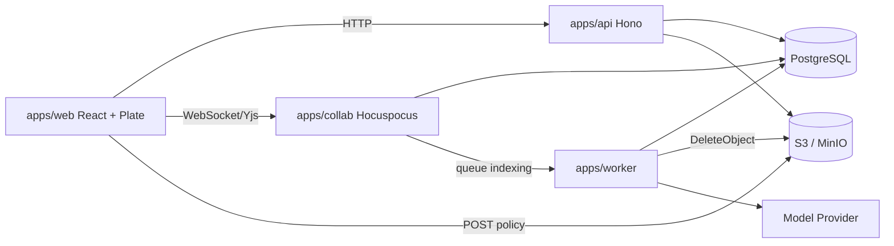

# ShareBrain 技术架构

## 目标定位

ShareBrain 是面向私有化交付、运维和项目团队的项目周期上下文管理平台。当前阶段已从框架骨架进入个人业务闭环：支持个人空间、账户与头像、空间容量、项目、新项目配置、模块记录、Markdown 文档、搜索读模型和完整媒体生命周期。

## 技术路线

| 层级 | 技术 | 决策 |
|------|------|------|
| Monorepo | Bun workspaces + catalog、Turborepo | Bun 统一包管理和运行时，Turbo 编排 app/package 任务 |
| Web | React 19、Vite 8、Plate 53、shadcn/ui、Tailwind v4 | 建立 Notion 风格个人工作台、模块页和 Markdown 编辑器 |
| 状态与数据 | TanStack Query、TanStack Router、Zustand、TanStack Table/Form | Router 管页面 URL 状态，Query 管服务端状态，Zustand 管局部 UI 状态 |
| API | Hono、Zod、OpenAPI | 轻量主业务 API，route/service 分层，所有入参出参基于 contract |
| 协作 | Hocuspocus、Yjs | 独立 WebSocket 协作服务，保存 CRDT snapshot |
| 数据 | PostgreSQL、Drizzle ORM | PostgreSQL 作为事实库，开发阶段 Drizzle push 直推 schema；模块记录 values 使用 jsonb |
| Worker | Bun、轻量 Mastra、Vercel AI SDK | 后台索引、摘要、chunk、embedding、媒体 GC 和周期任务 |
| 国际化 | `packages/i18n` | 默认中文，保留英文消息结构 |

## 服务边界

## 核心原则

- Hocuspocus 不承载业务 CRUD，只处理协作连接、权限校验、Yjs update/snapshot 和索引触发。
- Hono 是业务 API 的唯一入口，AI tool 也必须经过权限和审计边界。
- Worker 处理异步派生数据，不写入权限事实源，不绕过 API/domain service。
- PostgreSQL 保存 CRDT snapshot、Plate JSON、plain text、blocks、search items、chunks、audit logs。
- AI 最终回答必须基于 Context Pack，并附带可追溯证据来源。
- 自定义模块字段定义存表，记录值存 `module_records.values jsonb`，并按不可变 fieldId 存储。
- 系统固定模板为日志、项目背景和知识库；固定身份由系统模板来源派生，Web 只消费 API 返回的 `isSystemFixed`。模块 `kind` 创建后不可变，避免 timeline 记录字段和值语义被切换到 collection。
- 初始模块和项目模块的 key 分别按空间/项目唯一；active 冲突返回业务错误，软删除后同 key 且同类型创建会恢复原行。系统模板复制到空间时会恢复被软删除的固定来源模板，保证固定导航来源稳定；新项目只复制 `included_in_new_projects=true` 的初始模块。
- `collection` 当前只承载 documents，不支持记录级自定义字段；字段配置只服务 `timeline`。
- 用户内容时间线统一使用 `module_records`，`timeline_events` 不再作为用户内容事实源。
- 媒体对象使用 S3/MinIO 私有 bucket，API 按权限签发短时 URL，引用事实源为 `media_usages`。上传在 tenant 锁内确认配额后才签发 POST policy；头像按源文件与规范化输出上限的较大值预留，规范化后原子切换引用。被释放对象进入 `media_deletion_jobs`，Worker 使用媒体记录自身 bucket/key 物理删除并持久化重试。
- `media_objects` 行锁是 usage 恢复和物理删除决策的串行化边界；`deleting` 是不可逆删除栅栏。媒体 bucket 必须关闭 versioning，Worker 需具备 `s3:GetBucketVersioning` 才能证明删除语义。
- 文档 inline 媒体在上传完成时立即绑定 usage，并由 API/collab 文档物化按媒体节点 `sourceKey` 或媒体节点稳定 URL 校准；普通文本 URL 不形成引用。
- 模块 API 按聚合拆为 `ModuleTemplatesService`、`ProjectModulesService` 和 `ModuleRecordsService`；路由直接依赖对应 service，共享 access/member validation helper，不保留宽泛 facade。
- Web 页面身份以 TanStack Router URL 为事实源；文档编辑页、项目模块页、`/settings/new-project` 与 `/settings/storage` 必须支持刷新恢复、浏览器前进后退和深链接。Zustand 只承载侧栏、面板、弹层等局部 UI 状态。

## MVP 阶段顺序

1. 个人项目、模块、记录、文档、媒体和搜索读模型。
2. 正式登录、团队、邀请链接和成员管理。
3. Hocuspocus/Yjs 协作启用，worker 异步物化版本和索引。
4. Context Pack、项目知识问答、AI draft/suggestion。

## 官方资料核对记录

- Bun workspaces/catalog: 根 `package.json` 使用 workspace catalog 统一依赖版本。
- Turborepo: `dev` 任务标记 `persistent` 且禁用缓存，`build/typecheck/test` 分层依赖。
- Hono: 主 API 采用 Hono/OpenAPIHono，保持 Bun 运行时部署简单。
- Hocuspocus/Yjs: 协作服务独立部署，CRDT snapshot 作为二进制事实源，Plate JSON 是结构化派生结果。
- Hocuspocus 4: 服务端包声明 `engines.node >=22`，开发和部署运行时使用 Node，不使用 Bun runtime。
- Plate/shadcn: Plate 编辑器与 shadcn 组件复制式 UI 体系兼容，编辑器业务接入后续实现。
- TanStack: Query/Router/Table/Form 分别管理服务端状态、路由、表格和复杂表单。
- Drizzle: 开发阶段使用 `drizzle-kit push` 直推 schema，不生成 migration 文件；稳定阶段再引入迁移流。
- Mastra: 只作为 worker 的轻量 workflow/agent 层，不进入主业务 API。
