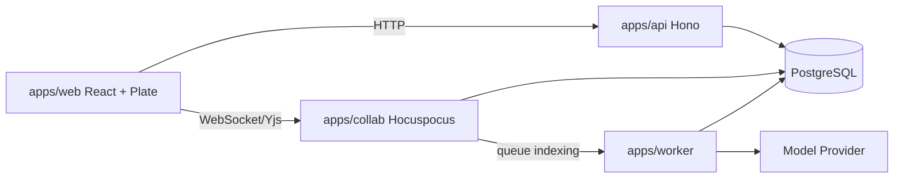

# ShareBrain 技术架构

## 目标定位

ShareBrain 是面向私有化交付、运维和项目团队的项目周期上下文管理平台。当前阶段只建立开发框架、模块边界和规范知识库，不实现项目、文档、权限、搜索、AI 的业务闭环。

## 技术路线

| 层级 | 技术 | 决策 |
|------|------|------|
| Monorepo | Bun workspaces + catalog、Turborepo | Bun 统一包管理和运行时，Turbo 编排 app/package 任务 |
| Web | React 19、Vite 8、Plate 53、shadcn/ui、Tailwind v4 | 建立 Notion 风格工作台和编辑器边界 |
| 状态与数据 | TanStack Query、Zustand、TanStack Router/Table/Form | Query 管服务端状态，Zustand 管局部 UI 状态 |
| API | Hono、Zod、OpenAPI | 轻量主业务 API，所有入参出参基于 contract |
| 协作 | Hocuspocus、Yjs | 独立 WebSocket 协作服务，保存 CRDT snapshot |
| 数据 | PostgreSQL、Drizzle ORM | PostgreSQL 作为事实库，开发阶段 Drizzle push 直推 schema |
| Worker | Bun、轻量 Mastra、Vercel AI SDK | 后台索引、摘要、chunk、embedding 和周期任务 |
| 国际化 | `packages/i18n` | 默认中文，保留英文消息结构 |

## 服务边界

## 核心原则

- Hocuspocus 不承载业务 CRUD，只处理协作连接、权限校验、Yjs update/snapshot 和索引触发。
- Hono 是业务 API 的唯一入口，AI tool 也必须经过权限和审计边界。
- Worker 处理异步派生数据，不写入权限事实源，不绕过 API/domain service。
- PostgreSQL 保存 CRDT snapshot、Plate JSON、plain text、blocks、search items、chunks、audit logs。
- AI 最终回答必须基于 Context Pack，并附带可追溯证据来源。

## MVP 阶段顺序

1. 基础项目、文档、Plate、Hocuspocus、Yjs snapshot。
2. 文档 block 抽取、`search_items`、全局和项目内搜索。
3. 时间线、文档关联事件、模板化复盘和交接。
4. Context Pack、项目知识问答、AI draft/suggestion。

## 官方资料核对记录

- Bun workspaces/catalog: 根 `package.json` 使用 workspace catalog 统一依赖版本。
- Turborepo: `dev` 任务标记 `persistent` 且禁用缓存，`build/typecheck/test` 分层依赖。
- Hono: 主 API 采用 Hono/OpenAPIHono，保持 Bun 运行时部署简单。
- Hocuspocus/Yjs: 协作服务独立部署，CRDT snapshot 作为二进制事实源，Plate JSON 是结构化派生结果。
- Hocuspocus 4: 服务端包声明 `engines.node >=22`，开发和部署运行时使用 Node，不使用 Bun runtime。
- Plate/shadcn: Plate 编辑器与 shadcn 组件复制式 UI 体系兼容，编辑器业务接入后续实现。
- TanStack: Query/Router/Table/Form 分别管理服务端状态、路由、表格和复杂表单。
- Drizzle: 开发阶段使用 `drizzle-kit push` 直推 schema，不生成 migration 文件；稳定阶段再引入迁移流。
- Mastra: 只作为 worker 的轻量 workflow/agent 层，不进入主业务 API。
