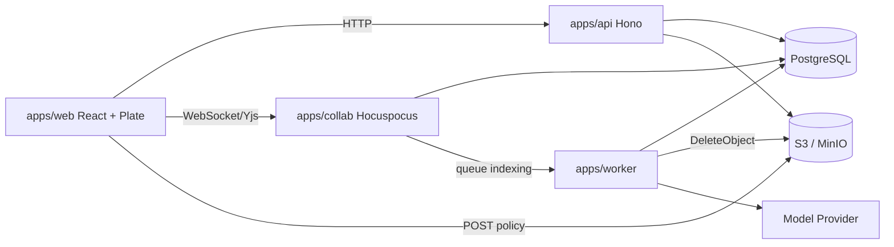
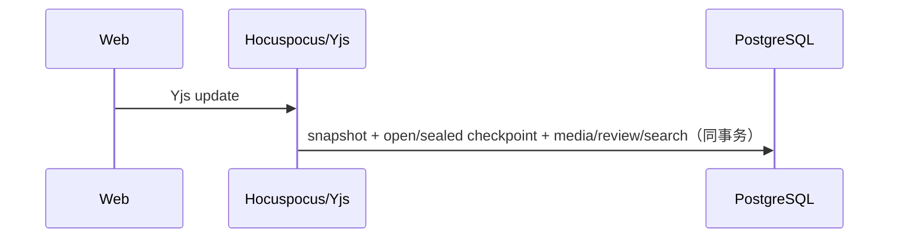
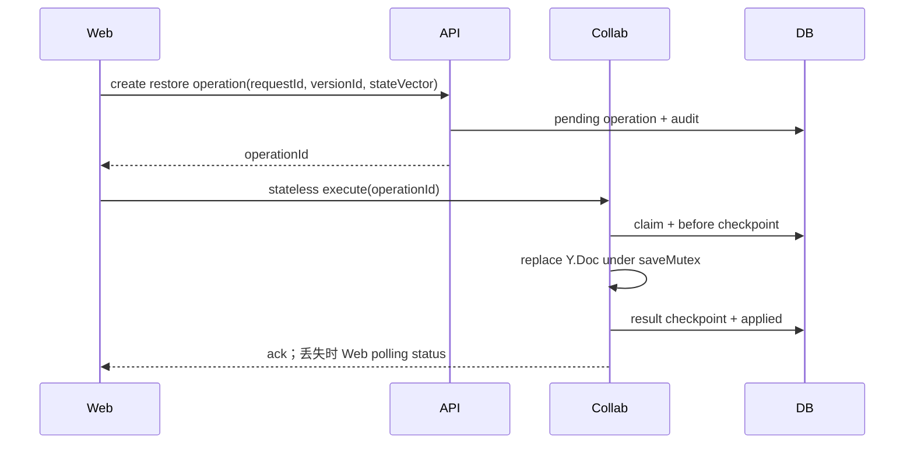
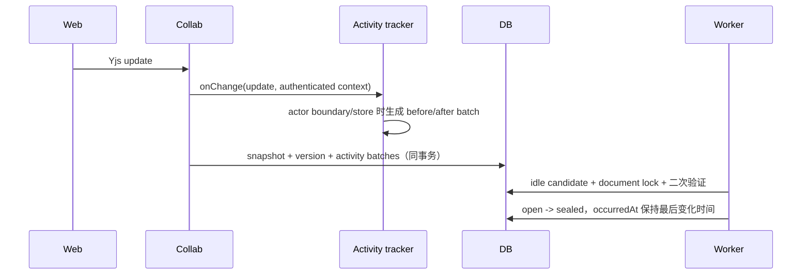

# ShareBrain 技术架构

## 目标定位

ShareBrain 是面向私有化交付、运维和项目团队的项目周期上下文管理平台。当前阶段已从框架骨架进入个人业务闭环：支持个人空间、账户与头像、空间容量、项目、新项目配置、模块记录、Markdown 文档、搜索读模型和完整媒体生命周期。

## 技术路线

| 层级 | 技术 | 决策 |
|------|------|------|
| Monorepo | Bun workspaces + catalog、Turborepo | Bun 统一包管理和运行时，Turbo 编排 app/package 任务 |
| Web | React 19、Vite 8、Plate 53、shadcn/ui、Tailwind v4 | 建立 Notion 风格个人工作台、模块页和 Markdown 编辑器 |
| 状态与数据 | TanStack Query、TanStack Router、Zustand、TanStack Table/Form | Router 管页面 URL 状态，Query 管服务端状态，Zustand 管局部 UI 状态 |
| API | Hono、Zod、OpenAPI | 轻量主业务 API，route/service 分层，所有入参出参基于 contract |
| 协作 | Hocuspocus、Yjs | 独立 WebSocket 协作服务，保存 CRDT snapshot |
| 数据 | PostgreSQL、Drizzle ORM | PostgreSQL 作为事实库，开发阶段 Drizzle push 直推 schema；模块记录 values 使用 jsonb |
| Worker | Bun、轻量 Mastra、Vercel AI SDK | 后台索引、摘要、chunk、embedding、媒体 GC 和周期任务 |
| 国际化 | `packages/i18n` | 默认中文，保留英文消息结构 |

## 服务边界

## 核心原则

- Hocuspocus 不承载业务 CRUD，只处理协作连接、权限校验、Yjs update/snapshot 和索引触发。
- Hono 是业务 API 的唯一入口，AI tool 也必须经过权限和审计边界。
- Worker 处理异步派生数据，不写入权限事实源，不绕过 API/domain service。
- PostgreSQL 保存 CRDT snapshot、Plate JSON、plain text、blocks、search items、chunks、audit logs。
- AI 最终回答必须基于 Context Pack，并附带可追溯证据来源。
- 自定义模块字段定义存表，记录值存 `module_records.values jsonb`，并按不可变 fieldId 存储。
- 系统固定模板为日志、项目背景和知识库；固定身份由系统模板来源派生，Web 只消费 API 返回的 `isSystemFixed`。模块 `kind` 创建后不可变，避免 timeline 记录字段和值语义被切换到 collection。
- 初始模块和项目模块的 key 分别按空间/项目唯一；active 冲突返回业务错误，软删除后同 key 且同类型创建会恢复原行。系统模板复制到空间时会恢复被软删除的固定来源模板，保证固定导航来源稳定；新项目只复制 `included_in_new_projects=true` 的初始模块。
- `collection` 当前只承载 documents，不支持记录级自定义字段；字段配置只服务 `timeline`。
- 用户内容时间线统一使用 `module_records`，`timeline_events` 不再作为用户内容事实源。
- 媒体对象使用 S3/MinIO 私有 bucket，API 按权限签发短时 URL，引用事实源为 `media_usages`。上传在 tenant 锁内确认配额后才签发 POST policy；头像按源文件与规范化输出上限的较大值预留，规范化后原子切换引用。被释放对象进入 `media_deletion_jobs`，Worker 使用媒体记录自身 bucket/key 物理删除并持久化重试。
- `media_objects` 行锁是 usage 恢复和物理删除决策的串行化边界；`deleting` 是不可逆删除栅栏。媒体 bucket 必须关闭 versioning，Worker 需具备 `s3:GetBucketVersioning` 才能证明删除语义。
- 文档 inline 媒体在上传完成时立即绑定 usage，并由 API/collab 文档物化按媒体节点 `sourceKey` 或媒体节点稳定 URL 校准；普通文本 URL 不形成引用。
- 模块 API 按聚合拆为 `ModuleTemplatesService`、`ProjectModulesService` 和 `ModuleRecordsService`；路由直接依赖对应 service，共享 access/member validation helper，不保留宽泛 facade。
- Web 页面身份以 TanStack Router URL 为事实源；文档编辑页、项目模块页、`/settings/new-project` 与 `/settings/storage` 必须支持刷新恢复、浏览器前进后退和深链接。Zustand 只承载侧栏、面板、弹层等局部 UI 状态。

## 正文版本历史

版本历史遵循四层边界，不能把完整产品能力下沉到 `packages/editor`：

| 层级 | 职责 |
|------|------|
| `packages/editor` | 只提供 Plate `Value` clone、预算估算、diff kit、只读 preview/diff 和图例；不知道 document、tenant、actor、分页、权限或恢复 operation |
| `apps/web` | 组合 Notion 风格历史工作区、sealed list/detail 查询、当前 live Y.Doc 投影、确认/冲突/force 交互 |
| `apps/api` | 校验租户、角色、媒体和频率限制，创建服务端 operationId，提供 sealed 只读 API 与 operation status；不覆盖活跃正文 |
| `apps/collab` | 在 Hocuspocus `Document.saveMutex` 内比较 state vector、保存 before checkpoint、替换 Y.Doc、广播并保存 result checkpoint |

普通编辑保存链路不变：

恢复链路使用持久化 operation，而不是 API 直接写正文：

正文版本使用 `formatVersion=1` 的确定性 Plate 投影和 canonical SHA-256 hash；根级文本叶子会先规范化为可渲染段落。comment、draft、diff 和 suggestion 临时元数据不会进入可恢复正文。自动 checkpoint 以 `createdAt` 作为固定五分钟活跃窗口，sealed payload 不再更新；最后一次有效正文保存空闲默认 120 秒后，Worker 在 document 行锁内二次验证并封存 current open auto，同时物化内容寻址 revision。列表只返回 sealed summary，当前项由 Web 从 live Y.Doc 合成。

空闲封存不创建新版本、不改正文 payload、versionNo、last editor 或媒体 usage；封存后的下一次真实编辑创建新的 open auto。`DOCUMENT_VERSION_IDLE_SEAL_SECONDS=0` 可关闭，多个 Worker 重复扫描通过相同 document 行锁和锁后二次验证保持幂等。

首期恢复只支持单 collab 副本。`DOCUMENT_VERSION_RESTORE_ENABLED=true` 且声明副本数大于 1、又未启用共享同步时 collab fail-fast；声明配置不能替代部署平台真实副本审计。横向扩容前必须引入共享 Yjs/awareness 同步并补脑裂、断线与 room affinity 验证。

版本保留默认 90 天，`0` 表示无限保留。Worker 默认 dry-run，删除时保护 current、保留期内 checkpoint、active operation 以及近期 operation 的 source/before/result 引用；删除 checkpoint 后仅在 version/activity/operation 均无引用时清理 revision 及其 `document_revision/inline` media usage。实际删除必须经过至少一个 dry-run 观察周期。

## 文档活动历史

活动历史回答“谁在什么时候做了什么”，版本历史回答“正文在某个 checkpoint 是什么、能否恢复”。两者共享 Yjs 变化源和 collab 保存事务，但使用独立的读模型、聚合周期、游标和 UI；活动事件不会替代版本 checkpoint，版本 diff 也不反推 actor 活动。

| 层级 | 职责 |
|------|------|
| `packages/editor` | 只通过 `NodeIdPlugin` 为非文本块提供稳定 ID；不包含 activity DTO、actor、tenant、权限、分页或会话策略 |
| `packages/contracts` | 定义活动 DTO、块级语义 diff、摘要限制和同会话净变化合并 |
| `apps/collab` | 使用 `onChange.context` 的认证 actor 和镜像 Y.Doc 收集批次；actor 切换或 store 时才投影，不逐击键序列化全文 |
| `packages/db` | 在 document 行锁内幂等写入事件、聚合 `(document,actor)` open session，并与 snapshot 使用同一事务 |
| `apps/worker` | 默认在最后一次语义变化空闲 120 秒后锁定 document、二次验证并封存 session |
| `apps/api` / `apps/web` | 提供 tenant/document 约束的 sequence 游标分页，以及 Notion 风格更新侧栏和打开期间 10 秒轮询 |

正文活动按 `(documentId, actorId)` 聚合。同一 actor 在 120 秒内再次产生语义变化会更新同一 open event，事件 sequence 同步前移；连续会话最长 30 分钟。open session 临时保存首个 before 与最新 after 投影，actor 切换或 idle/max 边界会立即封存上一段并物化 before/after revision，随后清除 session 临时正文。块摘要最多保存 50 项、每段最多 160 字符；完整语义 diff 从 revision 懒加载，不记录 IP 或 User-Agent。

`open` 表示编辑会话尚未封存，可检查临时 before/after 但不可恢复；`sealed` 表示会话已结束，正文活动可通过 after revision 恢复。版本 checkpoint 与活动 revision 复用同一 typed restore operation、state-vector conflict、force 和 ack/status fallback；标题和评论活动只展示摘要，不提供整页恢复。

## MVP 阶段顺序

1. 个人项目、模块、记录、文档、媒体和搜索读模型。
2. 正式登录、团队、邀请链接和成员管理。
3. Hocuspocus/Yjs 协作启用，worker 异步物化版本和索引。
4. Context Pack、项目知识问答、AI draft/suggestion。

## 官方资料核对记录

- Bun workspaces/catalog: 根 `package.json` 使用 workspace catalog 统一依赖版本。
- Turborepo: `dev` 任务标记 `persistent` 且禁用缓存，`build/typecheck/test` 分层依赖。
- Hono: 主 API 采用 Hono/OpenAPIHono，保持 Bun 运行时部署简单。
- Hocuspocus/Yjs: 协作服务独立部署，CRDT snapshot 作为二进制事实源，Plate JSON 是结构化派生结果。
- Hocuspocus 4: 服务端包声明 `engines.node >=22`，开发和部署运行时使用 Node，不使用 Bun runtime。
- Plate/shadcn: Plate 编辑器与 shadcn 组件复制式 UI 体系兼容，编辑器业务接入后续实现。
- TanStack: Query/Router/Table/Form 分别管理服务端状态、路由、表格和复杂表单。
- Drizzle: 开发阶段使用 `drizzle-kit push` 直推 schema，不生成 migration 文件；稳定阶段再引入迁移流。
- Mastra: 只作为 worker 的轻量 workflow/agent 层，不进入主业务 API。
