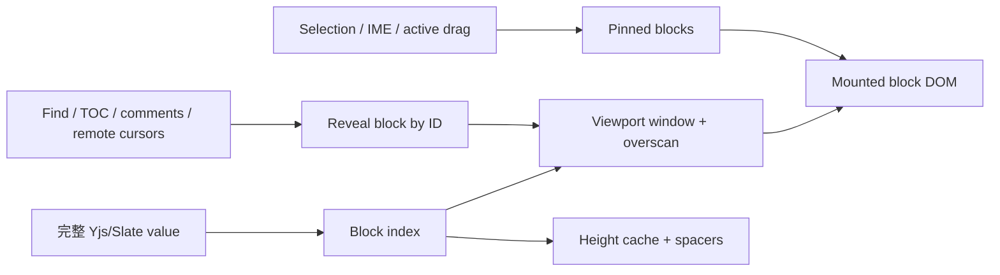

# 大文档编辑器性能优化现状与下一阶段路线

> 状态：第一阶段与历史只读优化已完成，可编辑窗口虚拟化待实施
>
> 更新日期：2026-07-15
>
> 范围：`apps/web`、`apps/api`、`apps/collab`、`packages/editor`、`packages/contracts`

## 1. 结论

第一阶段已经移除滚动、普通输入、首次加载和 Enter 热路径中可避免的全树订阅、全文扫描、重复正文请求、同步布局读取和逐块隐藏 UI 挂载。参考长文档包含约 1,200 个顶层块、4,900 个 Slate element 和约 6.3 万个初始 DOM；优化后正文 DOM 降至约 4 万，普通字符输入和 Enter 均有明显改善。

当前剩余瓶颈不再是某个单独插件，而是 Slate/React 仍需完整创建大文档 DOM，并在编辑事务和选区恢复期间遍历大量 `contenteditable` 后代。首次加载约 9.6 秒、Enter p95 约 248 毫秒，仍达不到无感体验。下一阶段应以块级 DOM 虚拟化和分阶段 hydration 为主线，而不是继续堆叠局部 memo。

历史 Changes 已从这条完整 DOM 成本中拆出：大版本 Diff 在 Web Worker 中计算，主线程只渲染变化块及相邻上下文。可编辑正文的 `content-visibility`/idle 预热实验没有降低 production 初始化最大长任务，并在开发构建产生约 38.9 秒长任务，已撤回；该结果进一步确认可编辑场景必须进入真正的块级窗口化，不能把延迟布局当作虚拟化。

不同轮次使用了结构相近但不完全相同的隔离文档，指标用于同轮前后对比，不应跨轮直接计算增益。

## 2. 已完成的优化

### 2.1 滚动热路径

| 优化 | 实现 | 结果 |
|------|------|------|
| 块 gutter | 用块类型对应的稳定 CSS offset 替代 hover 时的 `getComputedStyle` 和 React state；使用编辑器级 `pointermove` 委托，滚轮期间用独立 fixed shield 提前结束 hit-test | 固定指针下 90 次 wheel 的帧 p95 从 83.3ms 降到 33.4ms；基线 29 个长任务，优化后后两个稳定区段无长任务 |
| 浮动大纲 | 先移除滚动期间 observer 重建和标题布局读取，最终改为从 `h1-h6[data-block-id]` 构建语义列表，并通过 `elementFromPoint` 和 DOM 顺序确定活动标题 | 首次加载和滚动不再批量调用标题 `getBoundingClientRect` |
| 评论与远程光标 | 评论 wrapper 只装配顶层块；没有远程参与者时不挂载光标位置测量 | 降低长文档常驻订阅和布局测量 |
| Plate chunk | 将逻辑 chunk 调整为 50 个顶层块，并使用 `contain: layout style` 限制布局传播 | 普通更新影响范围收窄，保持完整浏览器查找和选区语义 |

`contentVisibilityAuto` 保持关闭。复杂表格、代码块首次进入视口时曾产生约 50-106ms、最高约 180ms 的揭示长任务，初始布局收益会转化为滚动卡顿，因此不作为正式方案。

### 2.2 普通输入与协作初始化

| 优化 | 实现 | 结果 |
|------|------|------|
| 评论索引 | 建立 editor 级 `BlockDiscussionIndexStore`；块组件用 `useSyncExternalStore` 只订阅自己的稳定快照；空评论普通文本操作走零扫描路径 | 未变化块不再因一次输入全部重渲染 |
| Toggle 索引 | 用按结构更新的可见性索引替代每块 `trackedEditor` selector | 普通文本和选区操作不再让全部折叠块失效 |
| TOC 刷新 | 根据 editor operations 判断是否涉及标题，普通段落文本操作复用标题快照 | 普通输入不再遍历整棵 Slate 树 |
| NavigationFeedback | 文档页关闭 Plate 默认的全 element 注入，TOC 保留直接滚动定位 | `useEditorSelector` 数量从约 4,976 降到约 90 |
| 评论总览 | 复用索引中的 present comment ID，不在关闭状态全文扫描 | 移除输入时的隐藏评论面板成本 |
| Yjs 首开 | Collab 无 snapshot 时从同租户最新正文版本构造 Y.Doc；Web 固定以 `value: null` 初始化 | 消除同步超过 5 秒时客户端误判空文档并重复回填正文的竞态 |

同规模 production `insertText` p95 从约 486ms 降至约 99ms，物理按键到下一帧 p95 约 77ms。后续综合基准中普通字符 p95 为约 78ms。`plaintext-only` 隔离实验只能再降低约 20-25ms，同时破坏富文本、粘贴和 IME 语义，因此未采用。

### 2.3 首次加载与 Enter

| 优化 | 实现 | 结果 |
|------|------|------|
| 正文传输去重 | 新增 `GET /api/documents/:id?includeContent=false`；编辑页使用独立 metadata query key，只由 Yjs 加载正文 | metadata 约 394B，不再等待和解析约 689KB HTTP 正文 |
| 交互控件惰性挂载 | 每块始终保留正文外壳；DnD source/target、DropLine、gutter、Tooltip 和 preview 在首次 pointer/drag 交互后挂载 | 初始 DOM 从约 62,953 降到约 39,938 |
| 空评论 presence gate | 评论和建议状态全空时，不挂载约 1,200 个逐块评论 UI 与外部 store 订阅 | 降低首次 React mount 和后续提交成本 |
| Enter 空索引快路径 | 空索引安全复用不会引入 mark 的 `split_node`、`set_node`、`insert/remove/move/merge`；可能引入评论/建议的数据仍保守检查 | Enter 不再为常见 `split/split/set` 批次重建全文评论索引 |
| 无效路径读取 | 使用 `NodeApi.getIf` 替代会构造异常文本的路径读取 | 避免无效旧路径把整棵 editor 序列化进异常信息 |

本轮隔离 production 结果：

| 指标 | 优化前 | 优化后 | 变化 |
|------|--------|--------|------|
| 正文块可见 | 15.3s | 9.6s | 约 -37% |
| 最大加载长任务 | 11.9s | 6.3s | 约 -47% |
| DOM 数量 | 62,953 | 39,938 | 约 -37% |
| 普通字符 p95 | 138ms | 78ms | 约 -43% |
| Enter p95 | 413ms | 248ms | 约 -40% |
| 90 次快速 wheel 最大长任务 | - | 约 61ms | 未出现 `content-visibility` 的 106ms 稳定回归 |

### 2.4 大文档历史 Diff 与只读渐进绘制

| 优化 | 实现 | 结果 |
|------|------|------|
| Diff 预算 | previous/current 分别使用 50,000 节点、5MiB 输入预算；annotated result 使用独立 100,000 节点、10MiB 预算 | 版本 5/6 各约 33,500 节点时不再因合计 67,031 节点被错误降级 |
| Worker-safe 计算 | 将纯预算、Diff 和上下文投影拆到不依赖 React、DOM、`BaseEditorKit` 的入口 | 真实版本 payload 总往返约 882ms、计算约 697ms；Worker raw bundle 从约 2.56MB 降至约 210KB |
| 变化上下文 | 递归识别顶层块内 marker，只渲染变化块及前后各 1 个上下文块 | 目标版本 5→6 显示 1 个 insertion marker，只挂载末尾 2 块并省略 2,414 个未变化块 |
| 历史入口惰性快照 | 检查历史版本/Activity revision 时不再预先深拷贝 live 全文；当前正文按需投影，restore 在执行时读取最新 Yjs state vector | 移除目标大文档打开历史时约 3 秒的无用主线程全文克隆 |
| 完整 Page | 将 Value 切成稳定的 50 顶层块批次；首批为独立只读 Plate，其余在 idle transition 中追加，交互后暂停 120ms | 目标版本首批从约 9.1s 降至约 0.88s，初始 DOM 约 1,228、最大首批任务约 325ms；49 批约 15.6s 完整 hydrate，最终 DOM/正文完整 |

## 3. 当前性能边界

1. Yjs 仍需要同步完整文档，Plate/Slate 仍需要把全部块转换为 React element。
2. 首次提交仍创建约 4 万个 DOM，单次主线程任务仍可能持续数秒。
3. React 19 在提交前保存绝对选区时会遍历大量 `contenteditable` 后代，普通输入和 Enter 都受 DOM 规模影响。
4. Enter 是结构操作，除文本更新外还涉及拆分节点、路径修正、选区恢复、Yjs 映射和布局提交，因此明显慢于普通字符。
5. 继续优化局部 selector、memo 或 CSS 只能得到递减收益，不能消除完整 DOM 的线性成本。

## 4. 下一阶段：块级虚拟化与分阶段 hydration

### 4.1 目标架构

编辑器仍持有完整 Yjs/Slate 数据模型，但 DOM 只挂载视口、overscan、当前选区、输入法组合区和必要锚点对应的块。未挂载块由稳定高度占位，并通过 block ID、路径和测量缓存恢复到 DOM。

### 4.2 实施阶段

| 阶段 | 工作内容 | 关键验收 |
|------|----------|----------|
| P0：测量与基线 | 建立固定大文档 fixture、统一加载/输入/Enter/滚动 trace、记录块高度和复杂块分布 | 同一 production build 可重复得到稳定 p50/p95、长任务和 DOM 指标 |
| P1：只读窗口原型 | 建立顶层 block index、高度缓存、上下 spacer、视口窗口和 overscan；先覆盖只读模式 | 滚动位置稳定，无累计跳动；挂载 DOM 与文档总块数解耦 |
| P2：可编辑窗口 | 当前选区块、相邻块和 IME composition 块固定挂载；实现光标跨窗口移动、Enter/Backspace 和粘贴 | 中英文 IME、撤销/重做、富文本粘贴和键盘选择无数据丢失 |
| P3：跨块能力 | 查找命中后 reveal；TOC、评论、建议、远程光标和活动历史按 block ID 唤醒目标；跨块选区动态扩展窗口 | 浏览器内查找替代方案、跨块复制、评论锚点和协作光标行为正确 |
| P4：复杂块与 DnD | 表格、代码块、媒体、Toggle、列布局采用可测量边界；拖拽支持未挂载目标的几何占位 | 不出现高度抖动、拖放错位、媒体重复加载或复杂块状态丢失 |
| P5：灰度与回退 | 通过 feature flag 按文档块数启用，保留完整 DOM fallback；采集真实文档长任务和输入延迟 | 指标异常或能力不支持时可立即回退，不修改正文数据格式 |

### 4.3 设计约束

- **选区与 IME：** composition 期间禁止卸载相关块；选区端点和跨块范围必须固定挂载。
- **查找：** 原生浏览器查找无法命中未挂载 DOM，需要维护纯文本 block index，并在命中后 reveal、定位和高亮。
- **评论与建议：** 锚点必须以稳定 block ID/文本位置映射，不能依赖当前 DOM 是否存在。
- **远程光标：** 视口外只维护逻辑位置；目标进入 overscan 后再计算几何位置。
- **拖拽：** 未挂载块必须有可预测占位高度和 drop target，不允许依赖所有块注册 HTML5 DnD source/target。
- **复杂块：** 表格和列布局不能简单按任意子节点虚拟化，首期边界应保持在顶层块。
- **协作：** 虚拟化只改变渲染层，不改变完整 Y.Doc、权限、版本、评论和持久化协议。

### 4.4 下一阶段性能预算

以下指标以约 1,200 个顶层块的固定 production fixture 为验收目标：

| 指标 | 当前 | 下一阶段目标 |
|------|------|--------------|
| 首屏正文可见 | 约 9.6s | p95 <= 3s |
| 页面恢复交互 | 约 11.3s | p95 <= 4s |
| 初始化最大长任务 | 约 6.3s | p95 <= 500ms，且无连续秒级阻塞 |
| 挂载 DOM | 约 39,938 | 常态 <= 10,000，且不随总块数线性增长 |
| 普通字符输入 | p95 约 78ms | p95 <= 50ms |
| Enter | p95 约 248ms | p95 <= 100ms |
| 稳定滚动 | 快速 wheel 最大长任务约 61ms | 稳定区段无 >50ms 长任务，帧间隔 p95 <= 33ms |

## 5. 明确不采用的替代方案

- 不直接启用 `content-visibility` 作为虚拟化替代，它会把布局成本推迟到滚动揭示阶段。
- 不使用 `plaintext-only` 换取小幅收益，它会改变富文本、粘贴和 IME 语义。
- 不通过移除大纲、评论、建议、拖拽或远程光标换性能；下一阶段必须保持这些能力。
- 不修改 Yjs/Slate 正文数据格式来服务渲染优化；虚拟化应限制在视图层。

## 6. 参考实现与历史记录

- [滚动性能优化方案](../helloagents/history/2026-07/202607141156_editor_performance/how.md)
- [普通输入性能优化方案](../helloagents/history/2026-07/202607150240_editor_input_performance/how.md)
- [首次加载与 Enter 性能优化方案](../helloagents/history/2026-07/202607150522_editor_load_enter_performance/how.md)
- [Web 编辑器宿主](../apps/web/src/features/editor/editor-shell.tsx)
- [块拖拽与 gutter](../packages/editor/src/ui/block-draggable.tsx)
- [评论索引](../packages/editor/src/lib/block-discussion-index.ts)
- [浮动大纲](../packages/editor/src/ui/editor-toc-sidebar.tsx)
