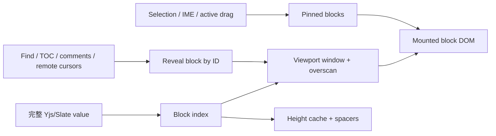

# 大文档编辑器性能优化现状与下一阶段路线

> 状态：P2-P5 可编辑窗口化及完整能力已完成，下一阶段转向模型/同步分阶段加载
>
> 更新日期：2026-07-16
>
> 范围：`apps/web`、`apps/api`、`apps/collab`、`packages/editor`、`packages/contracts`

## 1. 结论

第一阶段已经移除滚动、普通输入、首次加载和 Enter 热路径中可避免的全树订阅、全文扫描、重复正文请求、同步布局读取和逐块隐藏 UI 挂载。P2 进一步在保留完整 Yjs/Slate value 的前提下，将可编辑 DOM 收敛到视口、overscan、选区、IME 与显式 reveal 对应的 Plate chunk，屏幕外 chunk 使用测量或估算高度占位。

当前真实文档包含 2,463 个顶层块。最新 production 构建冷开约 3.4-3.9 秒进入可编辑态，同浏览器上下文复用 IndexedDB 快照约 2.42 秒；常态 DOM 约 1,575，165 个 chunk 中约 162 个保持占位，fallback 为 0。冷开最大长任务约 1.37 秒，已经消除此前 7-28 秒的大快照逐 operation 回放，但完整 Yjs→Slate hydrate 与 React element 首次创建仍决定首屏上限，还没有达到完全无感。

一次性 1,200 块 production 夹具验证了普通字符、跨 chunk Enter/Backspace、粘贴、undo/redo 和 composition。最新按键到下一帧指标为普通字符 p50/p95 约 22.1/30.7ms，Enter p50/p95 约 33.3/93.6ms；夹具在测试后删除并确认返回 404。下一阶段重点已从“是否能窗口化”转为更早的首屏数据和 React element 分阶段处理。

历史 Changes 已从这条完整 DOM 成本中拆出：大版本 Diff 在 Web Worker 中计算，主线程只渲染变化块及相邻上下文。可编辑正文的 `content-visibility`/idle 预热实验没有降低 production 初始化最大长任务，并在开发构建产生约 38.9 秒长任务，已撤回；该结果进一步确认可编辑场景必须进入真正的块级窗口化，不能把延迟布局当作虚拟化。

不同轮次使用了结构相近但不完全相同的隔离文档，指标用于同轮前后对比，不应跨轮直接计算增益。

## 2. 已完成的优化

### 2.1 滚动热路径

| 优化 | 实现 | 结果 |
|------|------|------|
| 块 gutter | 用块类型对应的稳定 CSS offset 替代 hover 时的 `getComputedStyle` 和 React state；使用编辑器级 `pointermove` 委托，滚轮期间用独立 fixed shield 提前结束 hit-test | 固定指针下 90 次 wheel 的帧 p95 从 83.3ms 降到 33.4ms；基线 29 个长任务，优化后后两个稳定区段无长任务 |
| 浮动大纲 | 先移除滚动期间 observer 重建和标题布局读取，最终改为从 `h1-h6[data-block-id]` 构建语义列表，并通过 `elementFromPoint` 和 DOM 顺序确定活动标题 | 首次加载和滚动不再批量调用标题 `getBoundingClientRect` |
| 评论与远程光标 | 评论 wrapper 只装配顶层块；没有远程参与者时不挂载光标位置测量 | 降低长文档常驻订阅和布局测量 |
| Plate chunk | 将逻辑 chunk 调整为 50 个顶层块，并使用 `contain: layout style` 限制布局传播 | 普通更新影响范围收窄，保持完整浏览器查找和选区语义 |

`contentVisibilityAuto` 保持关闭。复杂表格、代码块首次进入视口时曾产生约 50-106ms、最高约 180ms 的揭示长任务，初始布局收益会转化为滚动卡顿，因此不作为正式方案。

### 2.2 普通输入与协作初始化

| 优化 | 实现 | 结果 |
|------|------|------|
| 评论索引 | 建立 editor 级 `BlockDiscussionIndexStore`；块组件用 `useSyncExternalStore` 只订阅自己的稳定快照；空评论普通文本操作走零扫描路径 | 未变化块不再因一次输入全部重渲染 |
| Toggle 索引 | 用按结构更新的可见性索引替代每块 `trackedEditor` selector | 普通文本和选区操作不再让全部折叠块失效 |
| TOC 刷新 | 根据 editor operations 判断是否涉及标题，普通段落文本操作复用标题快照 | 普通输入不再遍历整棵 Slate 树 |
| NavigationFeedback | 文档页关闭 Plate 默认的全 element 注入，TOC 保留直接滚动定位 | `useEditorSelector` 数量从约 4,976 降到约 90 |
| 评论总览 | 复用索引中的 present comment ID，不在关闭状态全文扫描 | 移除输入时的隐藏评论面板成本 |
| Yjs 首开 | Collab 无 snapshot 时从同租户最新正文版本构造 Y.Doc；Web 固定以 `value: null` 初始化 | 消除同步超过 5 秒时客户端误判空文档并重复回填正文的竞态 |
| Yjs 批量 hydrate | 首次 provider sync 前延后 Slate `connect()`；Y.Doc 完整接收 IndexedDB 或远端 update 后一次性生成 children，再恢复实时增量监听 | 真实大文档不再将晚到快照翻译成数千次 Slate operation；冷开从约 15 秒回归降到约 3.4-3.9 秒 |
| 本地与服务端热缓存 | IndexedDB 按用户/文档隔离，远端认证完成后才允许展示缓存；单副本 Collab 使用租户/文档隔离的 30 分钟滑动过期、64 条/64MiB LRU snapshot cache | 同上下文重开约 2.42 秒；缓存不绕过远端权限确认，store/restore 会刷新或失效服务端缓存 |

同规模 production `insertText` p95 从约 486ms 降至约 99ms，物理按键到下一帧 p95 约 77ms。后续综合基准中普通字符 p95 为约 78ms。`plaintext-only` 隔离实验只能再降低约 20-25ms，同时破坏富文本、粘贴和 IME 语义，因此未采用。

### 2.3 首次加载与 Enter

| 优化 | 实现 | 结果 |
|------|------|------|
| 正文传输去重 | 新增 `GET /api/documents/:id?includeContent=false`；编辑页使用独立 metadata query key，只由 Yjs 加载正文 | metadata 约 394B，不再等待和解析约 689KB HTTP 正文 |
| 交互控件惰性挂载 | 每块始终保留正文外壳；DnD source/target、DropLine、gutter、Tooltip 和 preview 在首次 pointer/drag 交互后挂载 | 初始 DOM 从约 62,953 降到约 39,938 |
| 空评论 presence gate | 评论和建议状态全空时，不挂载约 1,200 个逐块评论 UI 与外部 store 订阅 | 降低首次 React mount 和后续提交成本 |
| Enter 空索引快路径 | 空索引安全复用不会引入 mark 的 `split_node`、`set_node`、`insert/remove/move/merge`；可能引入评论/建议的数据仍保守检查 | Enter 不再为常见 `split/split/set` 批次重建全文评论索引 |
| 无效路径读取 | 使用 `NodeApi.getIf` 替代会构造异常文本的路径读取 | 避免无效旧路径把整棵 editor 序列化进异常信息 |

本轮隔离 production 结果：

| 指标 | 优化前 | 优化后 | 变化 |
|------|--------|--------|------|
| 正文块可见 | 15.3s | 9.6s | 约 -37% |
| 最大加载长任务 | 11.9s | 6.3s | 约 -47% |
| DOM 数量 | 62,953 | 39,938 | 约 -37% |
| 普通字符 p95 | 138ms | 78ms | 约 -43% |
| Enter p95 | 413ms | 248ms | 约 -40% |
| 90 次快速 wheel 最大长任务 | - | 约 61ms | 未出现 `content-visibility` 的 106ms 稳定回归 |

### 2.4 大文档历史 Diff 与只读渐进绘制

| 优化 | 实现 | 结果 |
|------|------|------|
| Diff 预算 | previous/current 分别使用 50,000 节点、5MiB 输入预算；annotated result 使用独立 100,000 节点、10MiB 预算 | 版本 5/6 各约 33,500 节点时不再因合计 67,031 节点被错误降级 |
| Worker-safe 计算 | 将纯预算、Diff 和上下文投影拆到不依赖 React、DOM、`BaseEditorKit` 的入口 | 真实版本 payload 总往返约 882ms、计算约 697ms；Worker raw bundle 从约 2.56MB 降至约 210KB |
| 变化上下文 | 递归识别顶层块内 marker，只渲染变化块及前后各 5 个上下文块，相邻窗口自动合并 | 目标版本 5→6 可继续省略约 2,400 个未变化块，同时提供更容易辨认位置的局部正文 |
| 历史入口惰性快照 | 检查历史版本/Activity revision 时不再预先深拷贝 live 全文；当前正文按需投影，restore 在执行时读取最新 Yjs state vector | 移除目标大文档打开历史时约 3 秒的无用主线程全文克隆 |
| 完整 Page | 将 Value 切成稳定的 50 顶层块批次；首批为独立只读 Plate，其余在 idle transition 中追加，交互后暂停 120ms | 目标版本首批从约 9.1s 降至约 0.88s，初始 DOM 约 1,228、最大首批任务约 325ms；49 批约 15.6s 完整 hydrate，最终 DOM/正文完整 |

这里的“历史 Page 预览”仅指版本历史工作区中的完整只读版本正文。它和当前主页面的可编辑正文是两个独立渲染入口：`Changes` 只显示变化窗口，`Page` 渐进补齐所选历史版本全文；主编辑器仍使用一个完整 Plate/Slate editor，但从 P2 开始只提交当前窗口对应的可编辑 DOM。

### 2.5 可编辑正文块级窗口化 P2

| 优化 | 实现 | 结果 |
|------|------|------|
| 受保护 chunk 适配 | 从 Plate lowest chunk 的连续 Slate leaf 提取顶层范围、block ID/path、估高和复杂内容标记；缺 ID、重复 ID 或结构不连续时仅该 chunk 回退完整 DOM | Plate 私有结构依赖收敛到一个有单测的边界，不改变 Yjs/Slate 数据与协作协议 |
| 视口窗口与高度占位 | 文档页使用 15 块 chunk 与 700px overscan；`ResizeObserver` 异步缓存实测高度，未测量时使用节点类型与文本长度估高 | 当前 2,463 块文档 production 常态 DOM 约 1,575，165 个 chunk 中约 162 个保持占位，fallback 为 0 |
| 编辑安全固定挂载 | 首 chunk、选区范围及相邻块、composition、媒体、Toggle、列布局和 review 内容固定挂载；表格/代码块按顶层 chunk 边界处理 | 隔离夹具字符、跨边界 Enter/Backspace、粘贴、undo/redo、composition 全部通过且无运行错误 |
| 统一 reveal | Provider 维护 block/path 到 chunk 的索引；TOC 与评论先 reveal，等 DOM 提交后再定位 | 260 项完整大纲可点击最后标题；评论目标即使初始未挂载也能唤醒 |
| 窗口化大纲定位 | 大纲从完整 Slate model 建立 heading/path；滚动参考线在 chunk 换入前可按 chunk 几何范围回退，ResizeObserver 在布局稳定后重算 | 真实文档 0/25/50/75/100% 滚动对应活动索引 0/63/124/193/259，不再滞留首项 |
| 灰度与回退 | `WEB_PUBLIC_EDITOR_WINDOWING_ENABLED` 默认开启，`WEB_PUBLIC_EDITOR_WINDOWING_MIN_BLOCKS` 默认 800；浏览器能力缺失或适配失败时保持完整 DOM | 无 API、数据库、Yjs、版本或恢复格式迁移，可通过环境变量立即关闭 |

### 2.6 窗口化完整能力 P3-P5

| 优化 | 实现 | 结果 |
|------|------|------|
| 首帧单滚动根 | 文档页使用 `EditorContainer(document)`，保持 `height:auto/overflow-y:visible` | headed Chromium 连续 24 帧中，空壳到 259,274px 正文切换始终 `clientHeight === scrollHeight`，只出现浏览器页面滚动条 |
| 模型级全文查找 | Ctrl/Cmd+F 从完整 Slate value 建索引，将跨 mark offset 映射回精确 range，命中后按 ID/path reveal | 真实 2,426 块文档两个重复命中分别定位到约 127,879px/255,248px；P2 交互修复后 range 只映射为 CSS Highlight，不再改变编辑选区 |
| 跨块选择与协作 | 选区范围、相邻 chunk、composition 和鼠标选择走廊固定挂载；评论重新解析当前 path；remote mount revision 刷新且过滤异常几何 | 1,200 块夹具跨边界选择/复制与 undo/redo 通过；双客户端未挂载远程位置不绘制，换入后 caret 高 19px |
| 复杂块生命周期 | 表格、代码、媒体、Toggle、列和 review 保持完整顶层 chunk 边界，仅在 focus/selection/composition/pointer/drag/play 活动时固定 | 复杂夹具离屏占位、滚入挂载、活动固定、选区移走后恢复占位 |
| 虚拟占位拖放 | placeholder 按块估高将指针映射到稳定块边界，drop 时重新解析 ID/path，拒绝自身范围并在完成后 reveal | 850 块夹具首块拖到末端后定位约 38,721px，undo 后回到顶部；纯函数覆盖多选、前后移动、自身范围和滚动边缘 |
| 指标与会话熔断 | 发送无正文的 `sharebrain:editor-windowing-metric`；fallback 覆盖率、连续 reveal 失败和关键不变量可写入 sessionStorage 并切完整 DOM | 850 块熔断夹具超过 25% fallback 后 placeholder 为 0，刷新继续完整 DOM，持久化正文仍为 850 块 |

### 2.7 P2 布局、目录与中文查找交互修复

| 优化 | 实现 | 结果 |
|------|------|------|
| 正文 Grid 宽度 | 使用 `minmax(0, 1fr)` 和 `min-width: 0` 阻断长连续文本的 min-content 撑宽，桌面正文文本列统一为 820px | 1280/1440/1920/2048 四种视口中 article、title、editable 和首块中心线均与 viewport 中心一致；原约 140px 右偏归零 |
| TOC 定位与活动项 | 目录始终固定在视口最右侧 20px；活动项按按钮真实几何保持可见。wheel shield 覆盖正文或参考线落入窗口化 chunk 时，按块级估高映射当前 path，并在滚动结束后用真实 DOM 校准 | 点击“关闭严格模式”后连续 8 次 wheel，活动索引从 5 依次更新为 7/9/10/12/14/15/17，最终与参考线处“系统来源”一致，不再等到 50 块 chunk 结束才更新 |
| 中文 IME 查找 | composition 期间暂停 reveal/navigation；命中使用 CSS Highlight，不调用 `editor.tf.select/focus`，关闭时才恢复编辑器焦点 | 拼音组合期间焦点与 scrollY 均稳定；结束后查询“冲突处理”返回 1/8 并高亮、Slate 选中文本为空、浮动菜单为 0，关闭后高亮清理 |

### 2.8 首开峰值、连续滚动与目录舒适区

| 优化 | 实现 | 结果 |
|------|------|------|
| 非关键首包拆分 | 历史正文、AI runtime、HTML/DOCX 导出、Word 剪贴板解析和非常用代码语言改为调用时动态加载 | 普通正文首屏不请求 AI、历史正文、DOCX/HTML 或 Word 解析 chunk；`editor-shell` 约 1.387MiB/minified、365.6KiB gzip |
| 滚动感知 preview | 连续滚动保留已挂载富文本 chunk，新进入区域只显示每 chunk 一个聚合纯文本预览；停止 120ms 后再 hydrate 当前视口 | 90 次 wheel 帧 p50/p95 约 16.7/33.3ms，最大 33.4ms，0 帧超过 50ms，测量期间无 long task |
| 显式阅读锚点 | settle 前记录视口 88px 参考线所在 chunk 及内部相对位置；hydrate 和异步测高后在有限帧内补偿真实布局差值，任何新滚动输入立即取消补偿 | 真实 2,463 块文档直接定位 20%/50%/80% 和连续 wheel 后仍保持同一 chunk，阅读点漂移约 0.30-0.49px；TOC 目标顶部为 88.19px |
| TOC 增量与舒适区 | operation observer 与 TOC 本体隔离；普通段落输入不重建标题索引，chunk 命中使用二分；活动项离开 40%-60% 舒适区后居中，目录尾部保留半屏空间 | 260 个标题滚到底时最后一项“落地步骤”中心位于目录高度约 49.8%，不再贴住底边；每帧 chunk 几何读取从 O(n) 收敛到 O(log n) |
| 首次选区与路径探测 | 未聚焦首开不创建文档末尾 selection；精确 Path 查询使用无异常 `NodeApi.getIf` 快路径 | 避免 selection overlay 跨窗口测量，以及 Enter 越界探测序列化完整 editor |

## 3. 当前性能边界

1. Yjs 仍需要同步完整文档，Plate/Slate 仍会为完整 value 创建 React element；P2 只减少已提交 DOM，没有分片网络同步和模型解析。
2. 当前真实目标冷开最大长任务仍约 1.37 秒；完整 Yjs→Slate hydrate 和 React element 首次创建仍在主线程执行。缺 ID 或私有 chunk 元数据不满足约束的区间会局部回退完整 DOM。
3. 窗口模式已用模型索引替代浏览器原生查找；中文 composition 期间暂停定位，命中用非编辑 CSS Highlight 展示，避免抢焦点和唤起选区菜单；小文档仍保留浏览器原生查找。
4. 指标事件目前只在浏览器内派发，尚未接入服务端时序指标平台；固定 production fixture 与 p50/p95 trace 也尚未纳入仓库自动化。
5. 占位高度在首次实测前仍是估算值，因此滚动条总长度和绝对百分比可能随测高校正；当前阅读点已由显式 chunk 锚点稳定，preview 换入富文本后的实测漂移低于 0.5px。

### 3.1 为什么成熟云文档的可编辑首屏更快

飞书文档的内部实现没有足够公开信息可据此断言具体代码，但从可观察行为和大型块编辑器的通用架构看，其速度通常来自下面的系统级差异，而不是单个 React 优化：

1. 完整文档保留在本地数据模型中，DOM 只覆盖首屏、overscan、选区和输入法组合区；屏幕外块使用高度索引与占位，不参与 React/浏览器选区遍历。
2. 元数据、首屏块、目录索引和后续正文分优先级加载，并复用本地缓存或增量同步；首屏可编辑不等待所有块完成渲染。
3. 本地输入先更新最小块并完成绘制，协同广播、持久化、搜索索引、评论和目录派生在事务之后增量执行。
4. 自研块模型和渲染器能够直接维护 block ID、路径、高度和几何索引，不需要通用 Slate DOM 映射覆盖整篇文档。

ShareBrain P2-P5 已完成第 1 点的渲染层主体和跨块能力，并完成第 2、3 点中能在现有 Plate 边界内安全拆出的部分，但 block/path/height 几何仍建立在受保护的 Plate chunk 适配上，尚不是自研块模型。约 689KB 正文传输不是此前秒级长任务的唯一来源；完整 Yjs 同步、React element 创建以及局部完整 DOM fallback 仍决定首屏上限。

## 4. 窗口化阶段与后续模型分段

### 4.1 目标架构

编辑器仍持有完整 Yjs/Slate 数据模型，但 DOM 只挂载视口、overscan、当前选区、输入法组合区和必要锚点对应的块。未挂载块由稳定高度占位，并通过 block ID、路径和测量缓存恢复到 DOM。

### 4.2 实施阶段

| 阶段 | 工作内容 | 关键验收 |
|------|----------|----------|
| P0：测量与基线 | 🚧 已有真实目标与一次性夹具；仍需把固定 fixture 和 p50/p95 trace 纳入仓库测试工具 | 同一 production build 可重复得到稳定 p50/p95、长任务和 DOM 指标 |
| P1：只读窗口原型 | ✅ 历史 Page 已使用 50 块 idle 渐进绘制；P2 共用的估高/测高经验已验证 | 滚动位置稳定，无累计跳动；挂载 DOM 与文档总块数解耦 |
| P2：可编辑窗口 | ✅ 视口/overscan、选区相邻块、IME、Enter/Backspace、粘贴、undo/redo 已完成 | 隔离夹具无数据丢失、无运行错误，旧 chunk 在选区离开后恢复占位 |
| P3：跨块能力 | ✅ 模型全文查找、选择走廊、评论稳定路径和远程几何刷新已完成 | 真实文档双命中、1,200 块选择复制、双客户端远程光标通过 |
| P4：复杂块与 DnD | ✅ 活动 reason pin、复杂块释放和 placeholder drop target 已完成 | 复杂 fixture 与单/多块前后拖放验证通过 |
| P5：灰度与回退 | ✅ 结构化事件、fallback/reveal/invariant 熔断和会话完整 DOM 回退已完成 | 自动降级刷新保持且正文块数不变 |
| P6：模型与同步分段 | 📝 评估 Yjs 增量缓存、首屏块优先级和 Plate element 分阶段创建 | 首屏 p95 <= 3s，初始化最大长任务 p95 <= 500ms |

当前实现通过受保护适配器从 Plate 53 的私有 chunk children 恢复连续顶层范围，并在 ShareBrain 侧维护 ID/path/height 索引。后续升级 Plate 时必须保留适配单测与 fallback 覆盖率熔断；不能把熔断改成裁剪、改写或降级正文数据。

### 4.3 设计约束

- **选区与 IME：** composition 期间禁止卸载相关块；选区端点和跨块范围必须固定挂载。
- **查找：** 原生浏览器查找无法命中未挂载 DOM，需要维护纯文本 block index；composition 期间不得 reveal 或切换结果，命中后以 CSS Highlight 展示，不得修改 Slate 编辑选区。
- **评论与建议：** 锚点必须以稳定 block ID/文本位置映射，不能依赖当前 DOM 是否存在。
- **远程光标：** 视口外只维护逻辑位置；目标进入 overscan 后再计算几何位置。
- **拖拽：** 未挂载块必须有可预测占位高度和 drop target，不允许依赖所有块注册 HTML5 DnD source/target。
- **复杂块：** 表格和列布局不能简单按任意子节点虚拟化，首期边界应保持在顶层块。
- **协作：** 虚拟化只改变渲染层，不改变完整 Y.Doc、权限、版本、评论和持久化协议。
- **熔断：** 长任务只记录；只有适配覆盖率、连续 reveal 或关键几何/不变量失败才打开会话熔断。

### 4.4 下一阶段性能预算

以下指标以约 1,200 个顶层块的固定 production fixture 为验收目标：

| 指标 | P2 实测 | 后续目标 |
|------|---------|----------|
| 首屏正文可见 | 真实 2,463 块冷开约 3.4-3.9s，缓存重开约 2.42s | p95 <= 3s |
| 初始化最大长任务 | 冷开单次约 1.37s | p95 <= 500ms，且无连续秒级阻塞 |
| 挂载 DOM | 真实目标约 1,575；1,200 块夹具约 621 | 常态 <= 10,000 已满足；继续约束与总块数解耦 |
| 普通字符输入 | 1,200 块夹具按键到下一帧 p95 约 30.7ms | 浏览器内 p95 <= 50ms，已满足 |
| Enter | 同夹具 p95 约 93.6ms | 浏览器内 p95 <= 100ms，已满足 |
| 稳定滚动与大纲 | 90 次 wheel p95 约 33.3ms、无 >50ms 帧或 long task；hydrate 后阅读点漂移低于 0.5px；末项位于目录 49.8% | 稳定区段无 >50ms 长任务，帧间隔 p95 <= 33ms，继续观察边界波动 |

## 5. 明确不采用的替代方案

- 不直接启用 `content-visibility` 作为虚拟化替代，它会把布局成本推迟到滚动揭示阶段。
- 不使用 `plaintext-only` 换取小幅收益，它会改变富文本、粘贴和 IME 语义。
- 不通过移除大纲、评论、建议、拖拽或远程光标换性能；下一阶段必须保持这些能力。
- 不修改 Yjs/Slate 正文数据格式来服务渲染优化；虚拟化应限制在视图层。

## 6. 参考实现与历史记录

- [Diff 上下文与大纲同步修复](../helloagents/history/2026-07/202607150845_editor_diff_context_toc_sync/how.md)
- [可编辑大文档块级窗口化 P2](../helloagents/history/2026-07/202607150906_editor_editable_windowing/how.md)
- [窗口化完整能力 P3-P5](../helloagents/history/2026-07/202607151311_editor_windowing_p3_p5/how.md)
- [布局、目录与中文查找 P2 修复](../helloagents/history/2026-07/202607160159_editor_layout_toc_find_p2/how.md)
- [加载、输入与目录滚动回归修复](../helloagents/history/2026-07/202607160340_editor_load_input_toc_followup/how.md)
- [窗口滚动落点稳定修复](../helloagents/history/2026-07/202607160928_editor_scroll_anchor_stability/how.md)
- [滚动性能优化方案](../helloagents/history/2026-07/202607141156_editor_performance/how.md)
- [普通输入性能优化方案](../helloagents/history/2026-07/202607150240_editor_input_performance/how.md)
- [首次加载与 Enter 性能优化方案](../helloagents/history/2026-07/202607150522_editor_load_enter_performance/how.md)
- [Web 编辑器宿主](../apps/web/src/features/editor/editor-shell.tsx)
- [块拖拽与 gutter](../packages/editor/src/ui/block-draggable.tsx)
- [评论索引](../packages/editor/src/lib/block-discussion-index.ts)
- [浮动大纲](../packages/editor/src/ui/editor-toc-sidebar.tsx)
