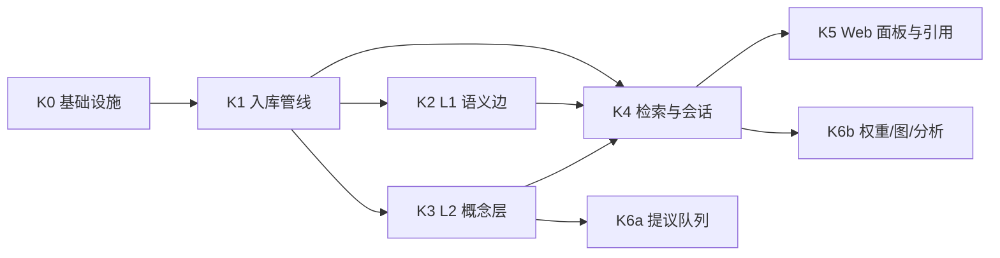

# 知识系统落地实施

配套设计文档：[knowledge-system.md](./knowledge-system.md)。本文只讲怎么做、按什么顺序做、每步做完怎么验证。

## 起点事实

动工前必须知道现状比"扩展已有索引"更空，这条链路基本是重写：

| 位置 | 现状 |
|------|------|
| `apps/api/src/modules/indexer/indexer.service.ts` | 占位实现：整篇文档写成 1 个 `document_blocks`（`blockId` 固定 `"root"`）+ 1 个 `document_chunks`（`chunkIndex` 恒为 0），token 按 `len / 4` 估 |
| `apps/worker/src/jobs/document-indexing.ts` | 只有一行 `console.info`，没有真实队列 |
| `apps/api/src/modules/search/search.service.ts` | `ilike '%q%'` 全表扫，按 `updatedAt` 排序，无 rank |
| 索引触发时机 | 在 API 请求链路内同步执行 |
| `packages/config` | 只有对话模型配置（`AI_BASE_URL`/`AI_API_KEY`/`AI_MODEL`/`AI_MAX_OUTPUT_TOKENS`），没有 embedding 配置 |
| `apps/api/src/modules/ai/ai.service.ts` | 单次 `generate` 流，无多轮、无检索、无引用 |

好消息是开发期使用 `db:reset:push`，没有历史数据迁移包袱；`document_chunks` 的结构可以直接改。

## 批次划分

依赖关系：



关键路径是 K0 → K1 → K4 → K5。K2、K3 可与 K4 的会话部分并行。

**K3 与 K6a 必须同批发布。** 概念抽取一旦开跑就持续产生 `proposed` 数据，没有确认入口的话队列会在两周内积压到无人愿意处理，图谱质量只会持续劣化。在 K6a 就绪前，`KNOWLEDGE_CONCEPT_EXTRACTION_ENABLED` 保持 `false`。

---

## K0 基础设施

**目标：** pgvector 可用、`packages/knowledge` 骨架就位、schema 落地、配置项就绪。此批不改变任何用户可见行为。

### pgvector 落地

`drizzle-kit push` 不管理扩展，必须单独处理：

1. `packages/db/src/scripts/reset.ts` 在 `create database` 之后连到新库执行 `create extension if not exists vector`。
2. 新增 `packages/db/src/scripts/ensure-extensions.ts` 与 `db:ext` 脚本，覆盖"不 reset 只 push"的场景；在根 `package.json` 把 `db:push` 改为先跑 `db:ext`。
3. Postgres 镜像换成带 pgvector 的版本（`pgvector/pgvector:pg17` 或在自建镜像中安装扩展），并写入部署文档与本地开发说明。

**这一步不做，后面所有 push 都会失败。**

### packages/knowledge

新建 workspace 包，遵循既有 package 边界规则（无业务含义、不依赖 app）：

```text
packages/knowledge/src/
  tokenize.ts       中文分词 + 小写化 + 空格连接（索引端与查询端共用）
  chunk.ts          Plate 投影 -> chunk 列表（标题切树、装箱、重叠、表格/代码整块）
  tokens.ts         token 估算（CJK × 1.3，其余 ÷ 4）
  concept-name.ts   概念名规范化（小写、去空格、全半角统一、去括号后缀）
  stopwords.ts      概念停用词表
  index.ts
```

`tokenizeForSearch` 必须被索引端和查询端同时使用，否则 FTS 召回会静默错位——这是应用层分词方案唯一的真实风险点，用一个共享函数消除它。

### schema 改动

在 `packages/db/src/schema.ts` 内完成，遵循既有风格（`ownedColumns` 展开、`idx_<table>_<用途>` 索引命名、软删除）。

需要注意的类型细节：

- `vector` 从 `drizzle-orm/pg-core` 导入；接入时确认当前锁定的 `1.0.0-rc.4` 已导出该类型，未导出则按 `bytea` 的既有 `customType` 模式自建。
- **`tsvector` 不是 drizzle 内置类型**，按文件顶部 `bytea` 的 `customType` 模式自建。
- `weight`、`manual_weight` 等浮点字段用 **`real` 而不是 `numeric`**：drizzle 的 `numeric` 默认以字符串返回，会在排序与算术处埋坑。
- 生成列使用 `.generatedAlwaysAs(sql\`to_tsvector('simple', search_text)\`)`；push 后必须到 `db:studio` 或 `psql` 确认列确实是 `GENERATED ALWAYS ... STORED`。
- 条件唯一索引使用 `uniqueIndex(...).on(...).where(sql\`...\`)`，用于 `knowledge_index_jobs` 的在途去重和 `knowledge_concepts` 的规范名唯一。
- HNSW 索引：`index(...).using("hnsw", table.embedding.op("vector_cosine_ops"))`。

改造与新增清单见设计文档《数据模型》一节。`KNOWLEDGE_EMBEDDING_DIM` 作为 `packages/db` 导出常量，不进环境变量。

### 配置

在 `packages/config/src/index.ts` 增加设计文档《配置》表中的全部变量。embedding 相关变量为空时回退到既有 `AI_*`，使单模型部署无需重复配置。

### 验收

- `bun run db:reset:push` 在干净库上成功，`create extension` 与生成列均生效。
- `bun run typecheck` 与 `bun run check` 通过。
- 现有搜索、文档、协作功能行为不变（此批不接线）。

### 回退

schema 变更未接线，直接还原 `schema.ts` 并 `db:reset:push`。

---

## K1 入库管线

**目标：** 文档、模块记录、项目真正被分块、分词、向量化，删除能正确传播。检索还未接线。

### 做法

1. **投递侧改造。** `apps/collab` 在 revision 封存后向 `knowledge_index_jobs` 投递 job（`reason='revision_sealed'`），仍遵守"只发 job，不在 WebSocket 链路内做重计算"。`module_records`、`projects` 的写入在 API 事务成功后投递。投递使用条件唯一索引做在途去重，反复编辑不堆积。
2. **Worker 消费。** 新建 `apps/worker/src/jobs/knowledge-indexing.ts`，复用 `media-gc.ts` 已验证的模式：拉取到期任务、行锁、状态机、指数退避、超时 `processing` 恢复、结构化日志（job id、输入摘要、失败原因、重试策略）。
3. **处理流程。** 取 revision `plate_json` → `packages/knowledge` 分块 → 逐块算 `content_hash` → **只对 hash 变化的块调 embedding** → 写 `document_chunks` 与 `knowledge_embeddings` → 旧 revision 的 chunk 置 `is_current=false` 后删除。
4. **删除传播。** `reason='deleted'` 时清理 chunk、embedding、以该实体为端点的 `knowledge_edges`，不动 `ai_message_citations`。
5. **退役旧实现。** `apps/api/src/modules/indexer/indexer.service.ts` 的 chunk/block 写入删除，只保留 `search_items` 维护并补上 `search_text`；`apps/worker/src/jobs/document-indexing.ts` 由新 job 取代。
6. **审计。** 每个 job 完成写一条 `ai.embedding`，metadata 按设计文档《审计与安全》。

### 验收

- 编辑文档后约 120 秒内（空闲封存节奏）出现新 chunk，`is_current` 正确翻转，旧 chunk 被清理。
- 只改一个段落时，embedding 调用次数远小于 chunk 总数（增量嵌入生效）——用 job 审计的 `chunkCount` 与实际调用数对比确认。
- 中文文档的 `token_count` 与实际 token 数偏差在可接受范围，不再出现远超上限的巨块。
- 文档软删除后 chunk 与 embedding 被清理，历史引用表不受影响。
- job 失败可重试，重启 Worker 不重复处理，不出现幽灵 `processing`。
- `bun run check` 通过。

### 回退

`KNOWLEDGE_INDEX_ENABLED=false` 停止投递与消费，既有功能不受影响。

---

## K2 L1 语义边

**目标：** `similar_to` 边可用，跨项目联想有确定性载体。

### 做法

- 新建 `apps/worker/src/jobs/knowledge-similarity.ts`。
- 文档向量 = 该文档全部 chunk 向量均值，落 `knowledge_embeddings(owner_type='document')`。
- 文档 embedding 更新后**增量**重算：只算这一篇的出边与受影响入边，不做全量 O(n²)。
- top-10、`cosine >= KNOWLEDGE_SIMILARITY_THRESHOLD`，跨项目边最多 6 条。
- 按 `sourceId < targetId` 规范序写单条边，查询时双向展开；`evidence.selectedBy` 保存选择该 pair 的端点 document ID。
- 刷新只撤销当前文档的选择权，另一端仍选择时保留边；对规范序 pair 获取 transaction advisory lock，防止双端并发刷新丢失选择权。缺少 `selectedBy` 的旧边按另一端选择处理并随刷新收敛。
- `evidence` 写 `{ kind: "similarity", cosine, model, sharedHeadings, selectedBy }`；`sharedHeadings` 来自两端 current chunk 的 heading path 交集，稳定排序并限制 8 条。
- 相似度同分时按 document ID 稳定排序，保证 top-k 结果可复现。

### 验收

- 人为准备两篇内容相近但分属不同项目的文档，索引后能查到 `similar_to` 边且 `cosine` 合理。
- 修改其中一篇后边被重算而非重复插入（唯一索引生效）。
- 两端先后或并发刷新时，刷新一端不会误删仍被另一端 top-k 选中的 incoming edge。
- 自动测试覆盖阈值、top-10、跨项目最多 6 条、双端选择权和 `sharedHeadings` 证据。
- 删除文档后相关边被清理。

### 回退

删除该 job 的调度；边表数据可留可清，不影响其它批次。

---

## K3 L2 概念层

**目标：** 概念抽取、归并、状态机可用。必须与 K6a 同批发布。

### 做法

1. **契约先行。** `conceptExtractionSchema` 与 `CONCEPT_TYPES` 放 `packages/contracts`，用 AI SDK `generateObject` 约束输出。
2. **候选注入。** 抽取前用文档向量召回 top-30 已有概念，把规范名/别名/描述放进 prompt，指令要求优先复用并返回 `existingId`。这是防碎片化最有效的闸门，不能省。
3. **引文校验。** 逐条校验 `evidenceQuotes` 确实出现在正文中，对不上的概念直接丢弃。零成本的幻觉过滤器。
4. **停用词过滤。** 抽取后、入队前用 `packages/knowledge/stopwords` 过滤泛化词。
5. **归并三层。** 规范名精确匹配 → 别名表命中（这两层自动）→ 概念 embedding 余弦 ≥ 0.90（**只生成合并建议，绝不自动合并**）。
6. **拒绝记忆。** `rejected` 概念的 `normalized_name` 参与去重，下次抽到同名直接丢弃，不再入队。**这是队列不被淹没的关键，不能漏。**
7. **分级放行。** 按设计文档《人工确认门槛》表实现：已 active 概念的 `mentions` 边自动放行，新概念与概念间关系进 `proposed`。
8. **合并操作。** 软合并（`status='merged'` + `canonicalId`），并把被合并方的 name 与全部 aliases 转为目标概念的 alias。
9. **计数维护。** `mention_count` 与 `project_spread` 在边状态变化时更新。

### 验收

- 同一概念用不同写法（`K8s` / `Kubernetes` / `k8s 集群`）出现在多篇文档时，最终收敛到同一个概念节点。
- 已拒绝的概念不再重复入队。
- 合并后旧概念行保留，历史引用能通过 `canonical_id` 解析。
- 关闭 `KNOWLEDGE_CONCEPT_EXTRACTION_ENABLED` 后，索引管线与 L0/L1 完全不受影响。
- 抽取失败或模型不可用时 job 退避重试，不阻塞 chunk/embedding 写入。

### 回退

`KNOWLEDGE_CONCEPT_EXTRACTION_ENABLED=false`，检索自动降级为 FTS + 向量两路。

---

## K4 检索与会话

**目标：** 端到端问答闭环打通，引用可返回。

### 做法

1. **访问边界。** `apps/api/src/modules/knowledge/knowledge-access.ts` 导出 `visibleProjectIds(auth)`，当前返回该 tenant 全部项目。检索与引用读取都只经此一个函数。
2. **范围解析。** 按设计文档五级优先级实现，结果写 `ai_messages.scope_resolution`。
3. **三路召回。** Tier A / Tier B 各跑 FTS、向量、概念三路，每路 top-30。向量路按 `shouldUseAnn(candidateCount)` 选择精确扫描或 HNSW（并设置 `hnsw.ef_search`）。
4. **RRF 融合。** `k=60`，Tier A/B 各自融合后合并。
5. **图扩展。** top-3 种子，1 跳，概念路径 0.7 / `links` 0.6 / `similar_to` 0.5，最多补 6 条，写 `retrieval.graphPath`。
6. **权重校准。** 贝叶斯平滑反馈乘数 × 人工乘数，来源为 `knowledge_source_scores`。
7. **预算装配。** Tier A ≥ 60%、图扩展 ≤ 15%、单文档 ≤ 3 chunk、单 chunk ≤ 1200 token、总预算 8000 token。
8. **流式协议。** 先发 `data-scope` 与 `data-citations`，再发正文流。assistant 消息在流结束时整体落库；中断则 `status='failed'` 保留部分内容。
9. **反馈写入。** 反馈事件写入后异步聚合到 `knowledge_source_scores`。
10. **trace。** 各阶段 top-20 候选写 `ai_retrieval_traces`，有界，不返回前端。
11. **搜索复用。** `search.service.ts` 改为使用 `search_vector` + `ts_rank`，与检索管线共用同一分词函数。

### 验收

- 在项目页内提问，引用中 Tier A 占比不低于配置下限（Tier A 候选充足时）。
- 全局页面提问时退化为纯 Tier B，`scope_resolution='none'` 或 `recent`。
- 引用中能出现跨项目来源，`tier` 与 `retrieval` 分数构成正确。
- 图扩展来源带完整 `graphPath`，能还原"因为什么被关联"。
- 手动把某来源 `manual_weight` 调到 0.5 后，相同提问下其排名下降。
- 单条引用赞踩后，`knowledge_source_scores` 聚合更新，且**单次踩不会让该来源直接消失**（平滑生效）。
- 历史消息在源文档被删除后仍能展示快照，且跳转被禁用、不返回 `snippet` 给无权用户。
- 每次问答写一条 `ai.chat` 审计。

### 回退

新增路由独立，摘除 `/api/ai/chat` 不影响既有 `/api/ai/command`。

---

## K5 Web 面板与引用

**目标：** 用户可见的完整体验。

### 做法

- 面板挂载在认证后的根布局层，与 `AccountMenu` 同级；未登录页面不挂载。
- 当前项目从 TanStack Router 路由参数读取，**不新建 Zustand store 追踪项目**；面板开关、宽度、折叠等临时 UI 状态才放 Zustand。
- 会话与消息走 TanStack Query，流式回答走 UIMessage 流。
- 悬浮触发按钮 + 独立于 `⌘+J` 的快捷键；编辑器内 AI 命令保持不变。
- 移动端从底部升起全屏 Sheet，参照文档活动历史侧栏的桌面/移动既有模式。
- 引用卡片按设计文档《引用卡片》实现，tier 标记用文字标签而非仅颜色，图标按钮带 `aria-label`。
- 文案走 `@sharebrain/i18n`，基础组件来自 `packages/ui`，卡片圆角不超过 6px、弱边框、无强阴影。

### 验收

- 跨页面导航时面板不卸载，流式回答与滚动位置连续。
- 从项目页导航到首页，面板的项目上下文随 URL 自动清空。
- 刷新页面后会话列表可恢复（会话是服务端状态）。
- 320px 宽度下不产生横向溢出。
- 引用卡片点击可跳转到目标文档并定位到 `block_ids` 对应段落。
- 源不可用时卡片降级展示，不出现死链。

---

## K6 管理台

### K6a 提议队列（与 K3 同批）

- `/settings/knowledge` 路由，复用 `features/modules` 的主从布局、Dialog/Sheet、二次确认模式，选中对象写入 URL。
- 三个 tab：新概念、概念关系、合并建议。支持批量确认与拒绝。
- 概念详情展示别名、提及文档、跨项目分布。
- 所有写操作 admin-only 并逐条写审计。

**验收：** 队列能清空；拒绝的概念不再出现；合并后别名正确转移；非 admin 无写入入口且 API 拒绝。

### K6b 权重、图与分析

- 权重页：按文档/项目/概念设置 `manual_weight`，展示当前反馈聚合。
- 关系图：只读力导向图，限定 1~2 跳与节点数上限，用现有依赖实现，不引入图可视化库。
- 反馈分析：引用次数 Top、总体赞踩比、按 `active_project` / `tenant_global` / `graph_expanded` 分组的赞踩与好评率、`wrong_project` 趋势；旧 API 未返回分组字段时 Web 补齐三组零值，支持滚动发布。
- 概念合并、关系状态与来源权重变更的审计保存完整 `before/after`；概念合并包含 source/target 两端。

**验收：** 图在节点超限时正确降级（提示收窄范围而非卡死）；权重调整立即影响下一次检索排序；三种 tier 均返回反馈计数（无数据为零）且治理审计可还原变更前后状态。

---

## 全局验证清单

每批完成后：

```bash
bun run typecheck
bun run check
bun run db:push        # schema 有变更时
```

数据库结构变更后必须人工确认：生成列是 `GENERATED ALWAYS ... STORED`、条件唯一索引的 `WHERE` 子句正确、HNSW 索引已建立。

## 风险与降级

| 风险 | 降级路径 |
|------|---------|
| Embedding 服务不可用 | 索引 job 退避重试；检索降级为 FTS 单路，引用仍可用 |
| 概念抽取质量差 | `KNOWLEDGE_CONCEPT_EXTRACTION_ENABLED=false`，检索降级为两路，L0/L1 不受影响 |
| 提议队列积压 | 提高自动放行门槛（把 `secondary` 也纳入自动 active），或临时关闭 L2 |
| 向量检索延迟高 | 调高 `KNOWLEDGE_ANN_ROW_THRESHOLD` 触发 ANN，或提高 `hnsw.ef_search` |
| 图扩展制造噪声 | 调低 `KNOWLEDGE_GRAPH_EXPANSION_MAX_RATIO` 至 0，图关联仅在管理台可视化，不进 prompt |
| 中文分词效果不足 | 分词器在应用层，可单独替换实现后跑一次全量重索引（`POST /api/knowledge/reindex`），不动数据库 |
| 索引管线拖慢协作 | 索引跟随 revision 封存，天然在协作链路外；若仍有影响，降低 Worker 并发 |

## 文档同步

每批完成后按设计文档《文档同步义务》更新 `docs/` 与 `helloagents/wiki/`，特别是：K0 后同步 `wiki/data.md` 与 `docs/project-structure.md`（新增 `packages/knowledge`），K4 后同步 `wiki/api.md`，K5/K6 后同步 `docs/standards/ui-design.md` 与 `wiki/modules/web.md`、`ui.md`。
