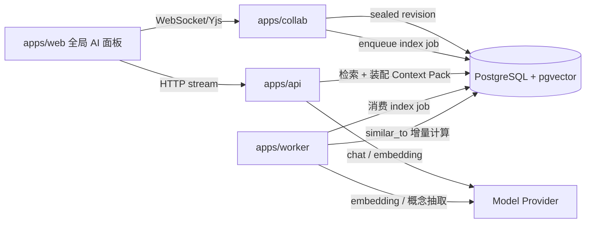

# 知识系统方案设计

## 目标定位

把 ShareBrain 从"以项目和文档组织的文档库"升级为"可检索、可解释、可校准的个人知识底座"。AI 不再只是编辑器内的正文命令，而是一个跨项目、跨会话、带引用来源的知识助理。

北极星目标写成可验证的工程目标，而不是"像不像一个人"：

> 给定一个问题，系统能在正确的范围内检索到正确的知识，给出可追溯的引用来源，并让这个检索质量通过用户反馈持续校准。

"数字分身"是这个目标做好之后的涌现效果，不作为设计输入。

## 范围

在范围内：

- 文档、模块记录、项目的知识入库（分块、中文分词、向量化、概念抽取）。
- 三层知识图谱（结构层、语义层、概念层）与图扩展检索。
- 用户级 AI 会话、混合检索、结构化引用来源、per-citation 反馈。
- 知识管理台（概念、提议队列、权重覆盖、关系可视化）。

不在范围内：

- 跨 tenant 的任何检索、记忆或图关联。
- 学习排序（learned reranker）模型训练。
- 历史 AI 对话本身作为可检索知识源（数据模型预留，能力后置）。
- 编辑器内 `⌘+J` AI 命令的能力扩展（ADR-020 边界不变）。

## 设计原则

- **确定性优先于概率。** 能用显式规则（路由 `projectId`、`project_recents`、用户显式选择）解决的范围判定，不退化成让模型猜。
- **检索与生成解耦。** 先用可解释的排序管线选出证据，再把证据交给模型生成回答；模型不参与"该不该被检索到"的决策。
- **一切排序可解释、可回放。** 每次检索的分数构成必须落库，管理台能回答"为什么是这几条"。
- **人工干预是一等公民。** 权重覆盖、概念确认、关系确认、反馈调整都有管理台入口和审计记录。
- **不引入新基础设施。** 向量检索用 pgvector，图关系用 Postgres 边表，不引入独立向量库或图数据库（ADR-002 PostgreSQL 优先，私有化交付要控制运维面）。
- **能推导的边不落库。** `contains`/`nests` 这类结构关系从业务表现算，不冗余到边表；边表只存业务表推导不出来的边。这与 `media_usages` 不使用 `refCount` 事实字段是同一原则。
- **tenant 是硬边界。** "全局记忆"只表示"当前激活 tenant 内的全局"，检索、图关联、会话记忆一律不跨 tenant。

### 明确否决的方案

| 方案 | 否决理由 |
|------|---------|
| 依赖大模型长上下文，把大量文档整体喂给模型 | "lost in the middle" 效应使中段信息利用率显著下降，且成本与延迟线性增长；工业界成熟方案一律是"先确定性过滤，再可解释排序，最后精选内容入 prompt" |
| 项目聚焦做成"权重加成乘数" | 乘数只能保证"通常更高"，无法保证"确定更高"；改为分层拉取 + token 预算下限的确定性规则 |
| 结构边冗余落入边表 | 文档移动、软删除、恢复都要同步边表，是典型的可推导冗余腐烂源 |
| 向量相似度自动合并概念 | 概念名普遍很短，短文本 embedding 区分度差，"灰度发布"与"蓝绿发布"相似度很高但语义不同；只产出合并建议，人工确认 |
| Elasticsearch / 独立向量库 / Neo4j | 私有化交付每多一个中间件就多一个运维面；当前体量 Postgres + pgvector + 递归 CTE 足够 |

## 总体架构



职责边界：

| 层 | 职责 |
|----|------|
| `packages/knowledge` | 中文分词、分块、token 估算、概念名规范化、停用词表。索引端与查询端共享同一实现 |
| `packages/contracts` | 引用 DTO、概念抽取输出 schema、检索 trace 类型、图 DTO |
| `packages/db` | schema 唯一来源、向量维度常量、检索 SQL store |
| `apps/collab` | 只在 revision 封存时投递索引 job，不在 WebSocket 链路内做重计算 |
| `apps/worker` | 分块、embedding、概念抽取、similar_to 计算、删除传播 |
| `apps/api` | 范围解析、检索管线、Context Pack 装配、流式回答、引用与反馈、管理台接口 |
| `apps/web` | 全局常驻面板、引用卡片、管理台 UI |

## 分层知识模型

知识图谱分三层，三层可独立降级：关闭 L2 时 L0+L1 仍构成完整检索能力。

| 层 | 边来源 | 计算方式 | 是否落 `knowledge_edges` |
|----|--------|---------|------------------------|
| **L0 结构层** | `contains`（project→document）、`nests`（document.parent_id）、`belongs_to`（module_record↔document） | 业务表现算 | 否 |
| **L0 解析层** | `links`（正文内部链接） | 解析正文块 | 是 |
| **L1 语义层** | `similar_to` | 文档向量 kNN，无 LLM | 是 |
| **L2 概念层** | `mentions`（document→concept）、`solves`/`depends_on`/`part_of`/`alternative_to`（concept→concept） | LLM 抽取 + 归并 + 人工确认 | 是 |

L1 是跨项目联想的主力承载：它用余弦相似度回答"整体上像"，可解释、可展示、无模型幻觉。L2 回答"讲的是同一件事"，精度更高但成本和噪声更高，因此必须配合归并与人工确认。

## 数据模型

### 核心不变量

- 所有新增业务表带 `tenant_id`、`created_by`、`updated_by`、`created_at`、`updated_at`、`deleted_at`。
- `document_chunks` 的事实源是 `document_revisions`（内容寻址、不可变），不是活正文；索引单位是 revision，不是 version。
- `knowledge_embeddings` 的向量维度由 `packages/db` 的 `KNOWLEDGE_EMBEDDING_DIM` 常量固定；维度是列定义的一部分，不是运行时行为，不允许用环境变量表达。
- `knowledge_edges` 只存业务表推导不出来的边；`similar_to` 按 `sourceId < targetId` 规范序存单条，查询时双向展开，并用 `evidence.selectedBy` 记录哪一端的 top-k 选择保留该边。
- 概念合并是软合并：`status='merged'` + `canonicalId` 指针，不删行，历史引用跟一跳指针解析。
- `ai_conversations` 归属 `(tenant_id, user_id)`，不带 `project_id`；项目上下文是消息级快照 `ai_messages.active_project_id`。
- `ai_message_citations` 的标题与片段是引用时刻快照；项目名实时 join；返回前端前必须重新做可见性校验。
- 会话、检索、图关联一律带 `tenant_id` 过滤，不存在跨 tenant 路径。

### 改造既有表

#### document_chunks

从"整篇一块"的占位实现改为真实分块，事实源从 `version_no` 改为 `revision_id`。

| 字段 | 变更 | 说明 |
|------|------|------|
| `revision_id` | 新增 | 指向 `document_revisions`，索引单位 |
| `version_no` | 移除 | 由 `revision_id` 取代 |
| `block_ids` | 新增 `text[]` | 该 chunk 覆盖的稳定块 ID，引用卡片跳转锚点 |
| `embed_text` | 新增 | 带项目/文档/章节上下文前缀的文本，向量化输入 |
| `search_text` | 新增 | 分词后空格分隔的文本，FTS 输入 |
| `search_vector` | 新增 `tsvector` | `to_tsvector('simple', search_text)` 生成列 + GIN 索引 |
| `token_count` | 改为非空 | 估算规则修正（见下） |
| `is_current` | 新增 `boolean` | 检索只查当前 revision 的 chunk |

唯一索引改为 `(revision_id, chunk_index)`。

#### search_items

同步增加 `search_text` + `search_vector` 生成列与 GIN 索引，替换现有 `ilike '%q%'` 全表扫。`entity_type` 枚举不变。

### 新增表

#### 派生数据的删除语义

知识侧的表都是从业务表算出来的，不能反过来挡住业务表的删除。`document_chunks`、`knowledge_embeddings`、`knowledge_edges` 对 `projects`/`documents` 的外键一律 `on delete cascade`：项目或文档被硬删时，它们的派生物跟着消失，不需要先跑一次清理任务。

例外是会话侧。`ai_messages.active_project_id` 用 `on delete set null`——消息是历史事实，项目没了只是指针失效，消息本身必须留下。`ai_message_citations.project_id` 干脆不建外键，它保存的是引用时刻的快照，与项目是否存在无关。

判断标准是一句话：**能重算的跟着走，不能重算的留下来。**

#### knowledge_embeddings

向量独立成表，不挂在 `document_chunks` 上：模型迁移期可双写两个 `model` 并存，宽 vector 列不影响 chunk 表的普通查询，维度变更不动主表。

| 字段 | 类型 | 说明 |
|------|------|------|
| `owner_type` | text | `document_chunk` / `document` / `module_record` / `concept` / `project` |
| `owner_id` | uuid | 宿主实体 |
| `project_id` | uuid nullable | 冗余，Tier A 硬过滤时避免 join |
| `model` | text | `"<model>@<dim>"`，模型与维度标识 |
| `embedding` | vector(DIM) | 余弦距离 |
| `content_hash` | text | 命中则跳过重算 |

唯一索引 `(owner_type, owner_id, model)`；HNSW 索引 `vector_cosine_ops`。

#### knowledge_edges

| 字段 | 类型 | 说明 |
|------|------|------|
| `source_type` / `source_id` | text / uuid | 多态端点，不建 node 表 |
| `source_project_id` | uuid nullable | 冗余，用于"项目内 vs 跨项目"过滤 |
| `target_type` / `target_id` | text / uuid | 同上 |
| `target_project_id` | uuid nullable | 同上 |
| `relation` | text | `similar_to` / `links` / `relates_to` / `mentions` / `solves` / `depends_on` / `part_of` / `alternative_to` |
| `weight` | real | 0~1；`similar_to` 存余弦值 |
| `origin` | text | `embedding` / `parser` / `ai` / `user` |
| `status` | text | `active` / `proposed` / `rejected` |
| `evidence` | jsonb | 可解释信息，直接供引用 UI 渲染 |
| `computed_at` | timestamptz | 增量重算判断 |

唯一索引 `(tenant_id, source_type, source_id, target_type, target_id, relation)`。

`evidence` 的形状按 relation 区分：

```ts
type KnowledgeEdgeEvidence =
  | { kind: "similarity"; cosine: number; model: string; sharedHeadings: string[]; selectedBy: string[] }
  | { kind: "mention"; salience: "primary" | "secondary" | "passing"; chunkIds: string[]; quotes: string[] }
  | { kind: "link"; blockIds: string[] }
  | { kind: "manual"; note: string };
```

#### knowledge_concepts

| 字段 | 说明 |
|------|------|
| `name` | 展示用规范名 |
| `normalized_name` | 归并键：小写化、去空格、全半角统一、去括号后缀 |
| `type` | 六类固定枚举，见下 |
| `description` | 最长 200 字 |
| `status` | `proposed` / `active` / `rejected` / `merged` |
| `canonical_id` | `merged` 时指向合并目标 |
| `origin` | `ai` / `user` |
| `mention_count` | 物化计数，管理台排序 |
| `project_spread` | 该概念覆盖的项目数 |

唯一索引 `(tenant_id, normalized_name)`，条件为 `status in ('proposed','active')`；`merged`/`rejected` 不参与唯一约束。

概念类型固定为六类，禁止自由 type（自由 type 会产生上百种类型，图谱失去可聚合性）：

| type | 含义 | 保留理由 |
|------|------|---------|
| `technology` | 技术、工具、框架 | 技术栈关联，跨项目复用主力 |
| `component` | 系统内模块、服务 | 架构问答的锚点 |
| `problem` | 故障现象、问题 | 跨项目联想的核心 |
| `solution` | 解决方案、做法 | 与 `problem` 配对 |
| `domain_term` | 业务领域术语 | 领域行话层 |
| `practice` | 流程、规范、约定 | 经验沉淀，交接文档骨架 |

不设 `person` 类型：具体的人在 `users` 表，不应被抽成概念节点。

`project_spread` 是本层最有信息量的派生指标：跨项目数 ≥ 2 的概念才是真正可复用的知识。管理台默认按它排序，而不是按 `mention_count`——出现 50 次但只在一个项目内的是项目术语，出现 8 次但横跨 4 个项目的是方法论。

#### knowledge_concept_aliases

`(tenant_id, normalized_alias)` 唯一。`origin` 为 `ai` / `user` / `merge`。概念合并时必须把被合并方的 name 和全部 aliases 转成目标概念的 alias，否则下次抽取会重新新建同名概念，人工合并成果被冲掉。

#### knowledge_source_scores

反馈校准与人工权重覆盖共用一张表，避免两套权重来源。

| 字段 | 说明 |
|------|------|
| `source_type` / `source_id` | 被评分的知识实体 |
| `up_count` / `down_count` | 来自 `ai_feedback_events` 的聚合 |
| `manual_weight` | 管理台人工设置的乘数，默认 1.0 |
| `recomputed_at` | 聚合时间 |

唯一索引 `(tenant_id, source_type, source_id)`。

#### knowledge_index_jobs

复用 `media_deletion_jobs` 已验证的持久化任务模式（指数退避 + 超时 `processing` 恢复）。

| 字段 | 说明 |
|------|------|
| `target_type` | `document` / `module_record` / `project` |
| `target_id` | 目标实体 |
| `reason` | `revision_sealed` / `record_changed` / `deleted` / `model_migration` / `manual` |
| `status` | `pending` / `processing` / `failed` / `completed` |
| `attempts` / `next_attempt_at` / `last_error` | 退避与可观测 |

关键索引：`(target_type, target_id)` 唯一，条件为 `status in ('pending','processing') and deleted_at is null`。同一目标同时只允许一条在途任务，反复编辑不会堆积。

#### ai_conversations / ai_messages

会话归属用户，不归属项目——同一段对话中用户可能从项目 A 聊到项目 B，对话记忆要延续但"当前项目"要跟着变。

`ai_messages` 关键字段：

| 字段 | 说明 |
|------|------|
| `sequence` | 会话内单调，由会话行锁分配 |
| `role` | `user` / `assistant` |
| `active_project_id` | 发送那一刻的项目快照，可空 |
| `scope_resolution` | `route` / `explicit` / `recent` / `inferred` / `none` |
| `status` | `streaming` / `complete` / `failed` |
| `usage` | token 用量与模型标识 |

`ai_messages` 预留 tenant/project 字段以便后续把历史对话本身作为知识源，但 P1 不为其建向量索引。

#### ai_message_citations

引用必须独立成表，不能塞 `ai_messages` 的 jsonb：需要支持 per-citation 反馈、按来源聚合统计、按 `source_id` 反查被引用次数，jsonb 这三件都做不到或需要全表展开。

| 字段 | 说明 |
|------|------|
| `rank` | 展示顺序，`(message_id, rank)` 唯一 |
| `source_type` / `source_id` | `document_chunk` / `module_record` / `project` |
| `project_id` | **"来自哪个项目"的字段**，跳转与聚合都依赖它 |
| `document_id` / `chunk_index` | 定位 |
| `block_ids` | 跳转锚点 |
| `heading_path` | 面包屑展示 |
| `title_snapshot` / `snippet` | 引用时刻快照 |
| `tier` | `active_project` / `tenant_global` / `graph_expanded` |
| `retrieval` | 分数构成与图路径 |

```ts
type CitationRetrievalTrace = {
  ftsRank?: number;
  vectorScore?: number;
  conceptScore?: number;
  rrfScore: number;
  feedbackMultiplier: number;
  manualMultiplier: number;
  finalScore: number;
  graphPath?: {
    seedDocumentId: string;
    seedTitle: string;
    relation: "similar_to" | "links" | "mentions" | "relates_to";
    weight: number;
    viaConceptIds?: string[];
  };
};
```

快照与实时的分工：

| 内容 | 策略 | 理由 |
|------|------|------|
| 文档标题 | 快照 | 文档可能被删，删后仍要展示"当时引用了什么" |
| 片段正文 | 快照 | 文档改动不得追溯改写历史回答的依据 |
| 项目名 | 实时 join | 项目数量少，join 便宜；改名后显示新名更符合直觉 |
| 是否可跳转 | 实时校验 | 读取时校验源仍存在且当前用户可见，否则降级为不可点击的"来源已删除/无权访问" |

最后一条是安全要求：引用片段是快照，但返回给前端前必须重新做可见性校验，否则历史会话会在权限收紧后继续泄漏内容。

#### ai_feedback_events

| 字段 | 说明 |
|------|------|
| `message_id` | 必填 |
| `citation_id` | 可空；为空表示对整条回答的反馈 |
| `vote` | `up` / `down` |
| `reason` | 可空枚举：`irrelevant` / `outdated` / `wrong_project` / `incomplete` |

`(message_id, citation_id, user_id)` 唯一，允许改票。`wrong_project` 单列的原因：它是范围解析质量的唯一直接量化信号。

#### ai_retrieval_traces

每条 assistant 消息一行，保存各阶段 top-20 候选的 id 与分数（有界 jsonb），只供管理台复盘，不返回前端。

## 知识入库

### 事实源与触发

索引输入是 `document_revisions`，不是活正文。这样白拿三件事：

1. **天然幂等去重。** revision 已按 `(document_id, format_version, content_hash)` 内容寻址去重，内容没变就没有新 revision，不需要另算一遍 hash。
2. **天然防抖。** 现有空闲封存机制（默认 120 秒无编辑后封存）已把高频编辑收敛为低频事件，不需要另做防抖窗口。
3. **不碰协作热路径。** embedding 是网络调用，绝不能进 collab 保存链路（ADR-022 定义 collab 为正文实时持久化入口）。

代价是刚写完的内容约两分钟后才可被检索到，UI 上以"知识索引中"状态标注。

`module_records` 与 `projects` 的索引在 API 写入成功后投递 job，不受封存节奏约束。

### 分块

输入是 revision 的 `plate_json`（已过 contracts v1 投影）：

1. **按标题层级切树。** H1/H2/H3 作为天然边界，每个叶子段落带完整 `headingPath`。
2. **按 token 上限装箱。** 目标 500~800 token，超限在段落边界切；不足 120 token 的块与相邻合并，避免"标题独占一块"的垃圾 chunk。
3. **重叠。** 相邻块共享约 100 token 尾部，防止答案被切在边界上。
4. **表格与代码块不切。** 整块成为一个 chunk，超长则截断并标记 `metadata.truncated`；切开的表格在向量空间中是纯噪声。
5. **上下文前缀。** `embed_text` 形如：

   ```
   项目：ShareBrain 私有化
   文档：部署手册
   章节：容器化 > 健康检查

   <正文>
   ```

   裸 chunk 丢失了"它在哪"的信息，向量空间中任何项目的超时配置都长得一样。加前缀后 Tier A/B 的区分度显著提升，代价是每 chunk 多 30~50 token。

**token 估算必须修正。** 现有 `Math.ceil(len / 4)` 对英文近似成立，对中文严重低估（中文 1 字约 1~1.5 token，不是 0.25），会把中文文档切成实际 2000+ token 的巨块。改为按字符类别分段估算：CJK 字符 × 1.3，其余 ÷ 4。不引入完整 tokenizer——依赖体积与收益不匹配。

### 中文关键词检索

`to_tsvector('simple', '容器健康检查配置')` 只会得到一个 token，中文 FTS 直接失效。方案选择应用层分词：

- `packages/knowledge` 导出 `tokenizeForSearch(text): string`：中文分词 + 英文小写化 + 空格连接。
- 索引端写入 `search_text`，DB 侧只用 `to_tsvector('simple', search_text)` 生成列。
- 查询端对 query 走同一函数后拼 `to_tsquery('simple', ...)`。

理由：Postgres 镜像已因 pgvector 改动一次，不再为分词扩展改第二次；分词器升级不需要重启数据库或重建扩展；索引端与查询端必须用同一分词器才能对齐，放在应用层反而更容易保证这一点。

### 向量化

- 维度由 `KNOWLEDGE_EMBEDDING_DIM` 常量固定，推荐 1024。
- **优先选支持维度截断（Matryoshka）的 embedding 模型**，使换模型时仍能对齐同一维度，避免"换模型必须重建 HNSW 索引与全表回填"。
- 增量嵌入：只对 `content_hash` 变化的 chunk 调用 embedding。文档改一段不重嵌整篇，这是成本的主要来源。
- 模型升级复用既有 backfill 哲学（参考 `document_versions.format_version` 的 expand → dry-run/apply 回填 → contract）：新模型以新的 `model` 值双写，回填完成后再切换检索读取，不写独立迁移逻辑。

**ANN 索引的启用条件。** HNSW 索引是全表的，叠加 `tenant_id`/`project_id` 过滤后存在经典的"过滤后召回不足"问题——ANN 返回 top-k，过滤掉大半，剩余不够用。规则：

- 候选集小于约 5 万行时不走 ANN，直接精确余弦扫描，Postgres 会选顺序扫，结果更准。私有化单 tenant 通常远小于该量级。
- 超过阈值后启用 HNSW，并把 `hnsw.ef_search` 提到 100~200 再过滤。

检索层实现 `shouldUseAnn(candidateCount)` 判断，避免早期做无意义调参。

### 入库范围

| 类型 | embedding owner | 用途 |
|------|----------------|------|
| 文档 chunk | `document_chunk` | 主力检索单元 |
| 文档整体 | `document` | 计算 `similar_to` 边 |
| module_record | `module_record` | 时间线记录——"什么时候发生了什么" |
| project | `project` | 项目 profile 向量，范围语义推断 |
| concept | `concept` | 查询侧概念匹配、合并候选检测 |

### 概念抽取与归并（L2）

L2 的难点在归并，不在抽取。逐篇独立抽取必然得到 `K8s` / `Kubernetes` / `k8s 集群` / `K8S 集群` 四个节点，边散落在不同节点上，图关联度接近零——这种图比不做更糟，因为管理台会显示一堆孤立点让人误以为图谱已建好。

**抽取时提供已有概念候选**，这是防碎片化最有效的一道闸门：

1. 用文档向量在 `knowledge_embeddings(owner_type='concept')` 中召回 top-30 已有概念。
2. 把候选概念的规范名、别名、描述放进 prompt。
3. 指令要求优先复用已有概念（返回其 id），确实没有对应项时才新建。
4. 用 AI SDK `generateObject` + Zod schema 输出结构化结果，与现有 provider 同一条链路。

输出契约从 `packages/contracts` 导出：

```ts
export const conceptExtractionSchema = z.object({
  concepts: z.array(z.object({
    existingId: z.string().uuid().nullable(),
    name: z.string().min(1).max(64),
    type: z.enum(CONCEPT_TYPES),
    description: z.string().max(200),
    aliases: z.array(z.string().max(64)).max(5),
    salience: z.enum(["primary", "secondary", "passing"]),
    evidenceQuotes: z.array(z.string().max(160)).min(1).max(3),
  })).max(8),
  conceptRelations: z.array(z.object({
    sourceName: z.string(),
    targetName: z.string(),
    relation: z.enum(["solves", "depends_on", "part_of", "alternative_to"]),
    confidence: z.number().min(0).max(1),
  })).max(6),
});
```

`evidenceQuotes` 必填：强制模型给出原文依据能显著降低幻觉概念，人工审核时也不必回原文即可判断。**服务端校验引文确实出现在正文中，对不上的概念直接丢弃**——这是零成本的幻觉过滤器。`concepts` 的 `.max(8)` 是硬上限，防止模型把每个名词都抽成概念。

**归并三层，只有前两层可自动：**

| 层 | 判定 | 处理 |
|----|------|------|
| ① 规范化精确匹配 | `normalized_name` 相等 | 自动合并，零风险 |
| ② 别名表命中 | `knowledge_concept_aliases` 查表 | 自动合并 |
| ③ 向量相似候选 | concept embedding 余弦 ≥ 0.90 | **只生成合并建议进人工队列，绝不自动合并** |

**被拒绝的概念必须记住。** `rejected` 状态参与去重：下次抽到同 `normalized_name` 直接丢弃，不再入队。否则模型偏爱的泛化词（"系统"、"配置"、"服务"）会每篇文档提议一次，一周内队列被淹没，人工审核直接放弃。配套在 `packages/knowledge` 维护初始停用词表，在抽取后、入队前过滤。

**人工确认门槛必须分级。** 一篇文档 5 个概念、100 篇文档就是 500 条待确认，全量人审等于没人审：

| 情形 | 处理 |
|------|------|
| 概念已 `active` + `salience=primary` + 引文校验通过 | `mentions` 边直接 `active` |
| 概念已 `active` + `salience=secondary/passing` | `mentions` 边直接 `active`，weight 降权 |
| 概念是新建的 | 概念进 `proposed`；其 `mentions` 边挂起，概念确认后一并放行 |
| `conceptRelations`（概念间关系） | 全部 `proposed`，噪声最大，不自动放行 |
| 向量相似触发的合并建议 | 进 `proposed`，管理台独立 tab |

人工队列因此只包含三类：新概念、概念间关系、合并建议。数量最大的文档-概念边在概念本身可信后自动流转。稳定运行后新概念产生速率应持续衰减——这是设计成立的前提，也是必须监控的指标。

**成本控制：** 只对 sealed revision 且正文超过 200 字的文档抽取；`content_hash` 未变不重抽；单文档一次调用，输入约 3~5k token；独立开关可整层关闭而不影响 L0/L1。

### 语义边计算（L1）

- 粒度是 **document 级**，不是 chunk 级。chunk 级相似边太碎（一篇文档 20 chunk × top-10 = 200 条边），图上无法阅读，也无法向用户解释。
- 文档向量取该文档全部 chunk 向量的均值。
- 每篇文档取 top-10、阈值 `cosine >= 0.72`，跨项目边与项目内边分别限流（跨项目最多 6 条）。
- `sharedHeadings` 取两端 current chunk 的 `heading_path` 交集，稳定排序并最多保留 8 条；同分候选按 document ID 稳定排序。
- 增量计算：文档 embedding 更新后只撤销该文档在 `evidence.selectedBy` 中的选择权，再加入本轮 top-k；另一端仍选择该边时不得删除，只有双方均未选择时才删除。旧边缺少 `selectedBy` 时先保守归属另一端，待其刷新后自然收敛。
- 同一规范序 pair 的刷新在事务内获取 advisory lock，避免两端并发刷新覆盖彼此的选择权；不做全量 O(n²)。

### 删除传播

文档软删除、项目删除、tenant 删除均通过同一队列以 `reason='deleted'` 投递，清理该实体的 chunk、embedding、以其为端点的全部 `knowledge_edges`、并递减相关概念的 `mention_count` / `project_spread`。

**引用表不清理**：`ai_message_citations` 持有快照，历史消息必须保真，只在读取时降级展示。

## 检索管线

```
1. 范围解析     → activeProjectId?
2. 三路召回     → FTS + 向量 + 概念，Tier A / Tier B 各跑一遍
3. RRF 融合     → score = Σ 1/(60 + rank_i)
4. 图扩展       → 沿 similar_to / mentions / links 走 1 跳
5. 权重校准     → 反馈平滑 × 人工覆盖
6. 预算装配     → Tier A 下限、图扩展上限、单文档上限
```

### 1. 范围解析

命中即停的优先级：

| 优先级 | 来源 | 判定 | `scope_resolution` |
|--------|------|------|-------------------|
| 1 | 路由上下文 | 用户在 `/projects/:projectId/...` 下唤起，直接取 URL | `route` |
| 2 | 会话内显式指定 | 用户在面板上手动选择项目 | `explicit` |
| 3 | 最近项目兜底 | 全局唤起时以 `project_recents` 作为弱信号 | `recent` |
| 4 | 语义推断 | 以上都未命中且消息中出现项目名/关键词时，用 project profile 向量匹配 | `inferred` |
| 5 | 无范围 | 纯 Tier B | `none` |

优先级 4 命中多个候选时在 UI 上显式追问，不静默选一个。

### 2. 三路召回

Tier A（当前项目，仅当范围已解析）与 Tier B（tenant 全域，去重掉 Tier A 已出现项）各跑三路，每路取 top-30：

| 通道 | 实现 |
|------|------|
| 关键词 | `search_vector @@ to_tsquery('simple', ...)`，`ts_rank` 归一化 |
| 向量 | `knowledge_embeddings` 余弦，按 `shouldUseAnn` 决定精确扫描或 HNSW |
| 概念 | query embedding 匹配 `active` 概念 → 取该概念 `salience=primary` 的 `mentions` 文档 |

概念通道能召回**字面与语义都不太像、但主题相同**的文档，是纯 RAG 召不到的部分。

### 3. RRF 融合

`score = Σ 1/(k + rank_i)`，`k = 60`。选 RRF 而非自造加权公式的理由：无超参、无需训练、对不同量纲的分数天然鲁棒。Tier A 与 Tier B 各自融合后再合并。

### 4. 图扩展

取 RRF 后 top-3 文档作为种子，沿边走 1 跳：

| 路径 | 衰减系数 | 说明 |
|------|---------|------|
| 概念路径（seed → primary concept → 其他项目同为 primary 的文档） | 0.7 | "讲的是同一件事"，精度更高 |
| `similar_to` | 0.5 | "整体上像" |
| `links` / `relates_to` | 0.6 | 显式关联 |

限流：最多补充 6 条，且总量受预算装配阶段的上限约束。每条补充项写入 `retrieval.graphPath`，供引用卡片渲染解释文案。

图扩展不改变"能不能被检索到"（Tier B 本来就跨项目），它改变的是**排序与解释**：分数中游但与当前项目核心文档有强关联的内容会被提上来，并能说清为什么。

### 5. 权重校准

```
finalScore = rrfScore × feedbackMultiplier × manualMultiplier
```

反馈乘数使用贝叶斯平滑，不允许单次反馈直接改权重：

```
ratio = (up + 1) / (up + down + 2)        // 无反馈时 = 0.5
feedbackMultiplier = 0.8 + 0.4 × ratio     // 无反馈时 = 1.0，范围 0.8 ~ 1.2
```

`manualMultiplier` 来自 `knowledge_source_scores.manual_weight`，默认 1.0，仅由管理台设置。

### 6. 预算装配

| 约束 | 默认值 |
|------|--------|
| 证据总预算 | 8000 token |
| Tier A 下限 | ≥ 60%（Tier A 候选不足时才可低于） |
| 图扩展上限 | ≤ 15%，计入 Tier B 额度 |
| 单文档最多 chunk 数 | 3 |
| 单 chunk 截断上限 | 1200 token |

Tier A 下限是把"项目上下文权重更高"变成**确定性、可测试**行为的关键——乘数只能保证倾向，下限才能保证结果。单文档上限同样重要：不加限制时一篇长文档会靠相似度霸占整个上下文预算，回答变得片面。

## 会话、引用与反馈

### 流式协议

复用现有 `/api/ai/command` 已在用的 AI SDK UIMessage 流。**检索在流内执行**，工作过程与引用都先于正文发出：

```
data-run        → { id, status }
data-scope      → { activeProjectId, resolution, projectName }
data-step       → { kind, status, detail, durationMs }   工作过程，逐步推送
data-citations  → Citation[]（完整引用列表）
text-start / text-delta ... / text-end                    正文流
data-finish     → { usage }        或 data-error → { code, message }
```

检索放在流内而不是流前，是为了让首字节立刻返回，用户看到的是"正在检索知识"而不是空等；否则三路召回加图扩展的一到三秒全部落在响应头之前。代价是检索失败不再是 HTTP 错误码，而是流内的 `data-error`，前端两条路径本来就都要处理。

先发引用有两个收益：用户在正文生成前就能看到 AI 正在参考哪些资料，体感更快；前端渲染逻辑也更简单，不需要在流末尾回填卡片。

**工作过程是事实，不是提示。** `data-step` 的每一步同时写入 `ai_run_steps`，历史消息读取时一并返回，因此刷新页面、换设备、后台恢复的回答都能看到同一份过程记录。步骤索引由 `kind` 在契约中的位置决定，`(run_id, step_index)` 唯一，重跑先清空再重建。认不出的步骤行（旧版本或未来版本写入的）在读取时静默丢弃——工作过程是辅助信息，不能因为一行记录让整条历史读不出来。

assistant 消息在流结束时整体落库（含 citations）；流中断时以 `status='failed'` 保留已生成部分。

### API 契约

| 方法 | 路径 | 说明 |
|------|------|------|
| POST | `/api/ai/chat` | 流式问答，入参含 `conversationId?`、`message`、`activeProjectId?`、`includeCrossProject?` |
| GET | `/api/ai/conversations` | 当前用户会话列表 |
| DELETE | `/api/ai/conversations/:id` | 软删除会话 |
| GET | `/api/ai/conversations/:id/messages` | 消息与引用，引用读取时做可见性校验 |
| POST | `/api/ai/messages/:messageId/feedback` | 整条回答反馈 |
| POST | `/api/ai/citations/:citationId/feedback` | 单条引用反馈 |
| GET | `/api/knowledge/concepts` | 概念列表，支持按 `project_spread` / `mention_count` 排序 |
| PATCH | `/api/knowledge/concepts/:id` | 确认、拒绝、改名、改类型 |
| POST | `/api/knowledge/concepts/:id/merge` | 软合并到目标概念 |
| GET | `/api/knowledge/proposals` | 提议队列，`kind=concept\|relation\|merge` |
| PATCH | `/api/knowledge/edges/:id` | 确认或拒绝关系提议 |
| GET | `/api/knowledge/graph` | 图数据，按 `projectId` / `conceptId` / `depth` 约束并限量 |
| GET/PATCH | `/api/knowledge/sources/:sourceType/:sourceId/score` | 查看与设置人工权重 |
| POST | `/api/knowledge/reindex` | admin，投递全量重建 job |

管理台写操作一律 admin-only。检索与引用读取统一走 `visibleProjectIds(auth)`——当前返回该 tenant 全部项目，未来引入 per-project ACL 时只改这一个函数。

## Web 交互

### 全局常驻面板

- **挂载点在认证后的根布局层**，与 `AccountMenu` 同级，跨页面导航时不卸载重建，流式回答和滚动位置保持连续。未登录页面不挂载。
- **当前项目从 TanStack Router 路由参数读取**，不新建 Zustand store 追踪。这是"Web 页面身份以 URL 为事实源"的自然延伸：面板订阅路由，不维护项目状态副本。
- 面板开关、宽度、折叠等临时 UI 状态放 Zustand；会话、消息、流式回答走 TanStack Query 与 UIMessage 流。
- 触发方式为悬浮按钮 + 独立于 `⌘+J` 的快捷键。
- **移动端不做常驻侧栏**（会挤压正文宽度并导致横向溢出），参照文档活动历史侧栏的既有模式：桌面固定宽度覆盖，移动端从底部升起全屏 Sheet。
- 与编辑器内 `⌘+J` 是两个独立功能，不合并：后者是作用于当前文档的单次 generate 流（ADR-020），前者是 tenant 内跨项目的多轮检索助理。

### 工作过程

回答上方是一条可折叠的工作过程栏，进行中自动展开、完成后自动折叠为"工作过程 N 步 · X.Xs"，点开可回看每一步的耗时与规模（三路召回各命中多少、图扩展补了几条、装配了几条证据多少 token）。这解决的是检索型助理最大的信任问题：用户看不到"它到底查了什么"，就无法判断答案该不该信。

折叠状态只在进行中被强制展开，结束后不再由代码控制，用户自己的展开/折叠选择得以保留。进行中的步骤没有耗时可显示，由前端本地秒表补上——模型迟迟不出字时，界面必须能区分"正在等"和"卡死了"。

面板宽度可从左边缘拖拽调整并记入 localStorage：宽度是使用习惯，不该每次打开都回到默认值。标题栏只保留会话标题与动作按钮，不放头像和副标题——面板出现的位置已经说明了它是什么。

### Markdown 渲染

回答按 Markdown 渲染，system prompt 明确要求模型用列表、有序步骤、带语言标注的围栏代码块和表格组织内容。

渲染管线针对流式做了三件事，缺一不可：

1. **按块记忆化。** `marked.lexer` 把正文切成顶层块，每块以 `raw` 为键用 `React.memo` 隔离。已完成的块在后续增量里被整体跳过，重渲染成本与回答长度无关，而不是每来一个 token 就重排整篇。
2. **按帧释放。** 网络增量先进 `ChatStreamBuffer`，每个动画帧只释放积压的一部分（积压多则追得快，见底则逐字收尾）。既把渲染次数压到每帧一次，也把 provider 成块吐字抹平成均匀出字。
3. **渲染隔离。** 缓冲区是外部 store，只有正在输出的那一个气泡订阅它。面板、会话列表、历史消息都不参与每帧重渲染。

token 直接渲染成 React 元素，不经过 `dangerouslySetInnerHTML`，正文里的 HTML 一律按文本显示，因此不存在注入面，也不需要引入消毒库。

### 附件

附件先上传成媒体对象，发送时只提交 `status=ready` 的 id，服务端复核归属、用途与就绪状态。模型侧由 AI SDK 把字节转成 base64 data URL 送给 provider（图片走 `image_url`，PDF 走 `file`）。

**可接受的类型必须在入口收敛。** provider 只认 `image/*`、`text/*` 和 `application/pdf`，其余类型会在转换阶段抛 `UnsupportedFunctionalityError`，把整条回答带崩。类型白名单因此定义在 `packages/contracts`，前端用它约束文件选择器并在加入前过滤，后端用同一份做提交校验——一份事实，两端共用。

聊天里的图片附件直接渲染缩略图（`max-h-56 object-contain`，懒加载），点击在新标签打开原图；非图片仍是文件名条目。

### 贴底跟随

流式输出时视口跟随底部，但**跟不跟随由用户手势决定，不能从"当前距底多远"反推**。

这条不是风格偏好，是被真实缺陷逼出来的：正文自己长高时（一帧塞进一个表格或代码块就是几百 px），内容提交后量出来的距底距离天然很大，用它判断会误判成"用户在回看历史"，从此再不跟随。表现是界面看起来卡死，实际内容一直在视口外增长——短回答长不了那么快，所以只有长 Markdown 才暴露。

正确的做法是把跟随当成一个只由 `wheel` 向上、`touchmove`、`ArrowUp/PageUp/Home` 翻页这些主动手势翻转的状态；用户滚回底部附近自动恢复，脱离期间给一个"回到最新"按钮。内容增长本身永远不改变这个状态。

**跟随由 `ResizeObserver` 驱动，不由 React 渲染驱动。** 真实高度变化发生在浏览器完成布局之后——字体加载、图片解码、Markdown 重排都会改高度，而这些都不对应一次 React 渲染。挂在 state 变化上必然漏掉，表现就是滚动跟不上正文。观察内容容器的尺寸变化才是完整的信号源，这也是主流 AI 聊天界面（以及 `use-stick-to-bottom` 一类实现）的通行做法。

自己写入的 `scrollTop` 会触发 `scroll` 事件，必须打标记排除，否则程序滚动会被当成用户手势立刻取消跟随。内容容器同时设 `overflow-anchor: none`，关掉浏览器自带的滚动锚定，避免它与我们的写入互相修正。

### 流式态与服务端数据的交接

流结束后**必须先把服务端消息灌进查询缓存，确认替代内容已经在手，再撤掉本地流式态**。反过来做会出现一段肉眼可见的空窗：回答已经从界面上消失，而 REST 还在路上（实测 200ms 以上）。若此时刷新失败，回答会一直不出现，直到用户关掉面板重新打开——从外面看就是"没有实时渲染，重开才有"。

新会话的 id 由 `data-run` 事件带回，不靠"取最近一条会话再比时间戳"去猜。猜测在两个标签页同时提问或手速快时会挂到错的会话上，而且拿不到 id 时前一版会连带把回答清空。现在拿不到 id 就保留本地结果，宁可多留一会儿也不抹掉。

### 服务器空闲超时

**`Bun.serve` 的 `idleTimeout` 默认只有 10 秒，必须显式调高，否则流式回答根本活不下来。**

这是整条链路上最隐蔽的一处。推理模型在首个 token 之前思考十几秒是常态，这期间连接上没有任何字节流动，Bun 判定空闲并掐断整个请求。表现极具误导性：工作过程正常走完、停在"生成回答"，然后前端的流突然 EOF；而服务端此时仍在生成，写完落库，用户重新打开面板就看到**整段回答一次性出现**——看起来像"根本没有流式渲染"，实际是流被服务器自己杀掉了。

把请求的 `AbortSignal` 接进 `streamText` 之后，这个超时会进一步伪装成用户主动停止（`AI_GENERATION_STOPPED`），更难追查。

`API_IDLE_TIMEOUT_SECONDS` 默认 240 秒（Bun 上限 255）。**任何自建的流式测试桩也要同样设置**，否则复现出来的是桩的超时而不是产品行为。

### 停止与中断

生成中输入框的发送位换成停止按钮。请求的 `AbortSignal` 一路传到 `streamText`，点停止会真正切断 provider 调用而不只是前端不再显示，已生成的部分保留为 `AI_GENERATION_STOPPED`。

**关闭面板不等于停止。** 面板卸载时不中止请求——durable run 会把回答写完，重新打开从 REST 历史读回。只有停止按钮是用户明确的中止意图。这是 durable run 存在的意义，不能被前端的生命周期抵消。

推理模型可能把输出预算全花在思考上，正常结束却一个字都没产出。这种情况显式报 `AI_EMPTY_COMPLETION` 而不是静默写入空回答，否则界面看起来就是卡死。

用户主动停止和空输出都是**终态失败**：重跑只会得到同样的结果。`ai_assistant_runs.retryable` 标记它们，后台恢复循环不再认领——否则点了"停止"，几秒后循环就会把生成重新跑起来。手动重试仍然穿透终态：充了值、改了配置之后用户该能再试。

### 引用卡片

消息底部一条折叠栏（"参考了 6 条知识 · 3 个项目"），展开为来源卡片列表。每张卡片：

- 左上角 tier 标记：`当前项目` / `跨项目` / `图关联`。
- 项目名 + 文档标题 + `headingPath` 面包屑。
- 片段快照，限制行数。
- 图关联卡片额外展示解释文案，由 `retrieval.graphPath` 与 `knowledge_edges.evidence` 渲染，例如"与当前文档共同涉及〔健康检查探针〕〔就绪探针超时〕"。这比展示"相似度 0.83"更有说服力，也是知识图谱对用户可感知的价值落点。
- 右侧 `👍`/`👎` 与"打开"命令；源不可见时禁用跳转并标注状态。

样式遵循既有 Notion 气质：卡片圆角不超过 6px、弱边框、无强阴影，tier 标记用文字标签而非仅颜色区分。

### 管理台

路由 `/settings/knowledge`，与 `/settings/new-project`、`/settings/storage` 同级，复用 `features/modules` 已跑通的信息架构：块级列表 + 详情主从布局、创建用 Dialog、编辑用 Sheet、破坏性动作二次确认、选中对象写入 URL。

| 子页 | 内容 |
|------|------|
| 概念 | 列表按 `project_spread` 默认排序，详情展示别名、提及文档、跨项目分布 |
| 提议队列 | 三个 tab：新概念、概念关系、合并建议；支持批量确认/拒绝 |
| 权重 | 按文档/项目/概念设置 `manual_weight`，展示当前反馈聚合 |
| 关系图 | 只读力导向图，限定 1~2 跳与节点上限，用现有依赖实现，不引入图可视化库 |
| 反馈分析 | 引用次数 Top、总体赞踩比、按 `当前项目` / `跨项目` / `图关联` tier 分组的赞踩与好评率、`wrong_project` 反馈趋势 |

**提议队列必须与概念抽取同期上线。** L2 一旦开跑就在持续产生 `proposed` 数据，没有确认入口的话两周后会积压数百条无人处理的提议，图谱质量只会持续劣化。

## 配置

新增环境变量（统一在 `packages/config` 校验，不在 app 内散读 `process.env`）：

| 变量 | 默认 | 说明 |
|------|------|------|
| `AI_EMBEDDING_BASE_URL` | 空 | 为空时回退 `AI_BASE_URL` |
| `AI_EMBEDDING_API_KEY` | 空 | 为空时回退 `AI_API_KEY` |
| `AI_EMBEDDING_MODEL` | — | 必填才能启用向量检索 |
| `AI_EMBEDDING_BATCH_SIZE` | 32 | 单次批量嵌入条数 |
| `AI_EXTRACTION_MODEL` | 空 | 概念抽取模型，为空时回退 `AI_MODEL` |
| `KNOWLEDGE_INDEX_ENABLED` | `true` | 关闭后不投递也不消费索引 job |
| `KNOWLEDGE_CONCEPT_EXTRACTION_ENABLED` | `false` | L2 开关，默认关闭，确认队列就绪后开启 |
| `KNOWLEDGE_CONTEXT_TOKEN_BUDGET` | 8000 | 证据总预算 |
| `KNOWLEDGE_ACTIVE_PROJECT_MIN_RATIO` | 0.6 | Tier A 下限 |
| `KNOWLEDGE_GRAPH_EXPANSION_MAX_RATIO` | 0.15 | 图扩展上限 |
| `KNOWLEDGE_SIMILARITY_THRESHOLD` | 0.72 | `similar_to` 建边阈值 |
| `KNOWLEDGE_ANN_ROW_THRESHOLD` | 50000 | 超过该候选行数才启用 HNSW |

向量维度**不作为环境变量**：它决定列定义而非运行时行为，由 `packages/db` 的 `KNOWLEDGE_EMBEDDING_DIM` 常量表达。

## 审计与安全

- embedding 与概念抽取按 **job 聚合**写审计，不按 chunk 逐条写（一次索引可能产生数十次调用，逐条会淹没 `audit_logs`）。action 分别为 `ai.embedding`、`ai.concept_extraction`，metadata 记 `{ jobId, targetType, targetId, chunkCount, totalTokens, model, requestId }`。
- 问答按请求写一条 `ai.chat`，metadata 记 `{ requestId, conversationId, activeProjectId, scopeResolution, citationCount, promptTokens, completionTokens, model }`。
- 管理台写操作（概念确认/拒绝/合并、权重覆盖、关系确认）逐条写审计，记录 actor 与完整 `before/after`；概念合并同时记录 source/target 两端状态。
- prompt 中不注入密钥、连接串或用户不可见的权限数据。
- 引用片段是快照，但读取时必须重新做可见性校验；不可见时只返回状态标记，不返回 `snippet`。
- 检索、图查询、引用读取的每一条 SQL 都必须带 `tenant_id` 过滤；不存在跨 tenant 路径。

## 可观测性

需要长期跟踪的指标（管理台反馈分析页 + Worker 日志）：

| 指标 | 健康信号 |
|------|---------|
| 每周新增概念数 | 应随时间持续衰减；若不衰减说明归并失效 |
| 提议队列积压量 | 应保持低位；持续增长说明确认门槛设置过严 |
| `wrong_project` 反馈占比 | 范围解析质量的直接信号 |
| 引用点击率 | 引用是否真的被用户使用 |
| 赞踩比按 tier 分组 | 判断图扩展是否在制造噪声 |
| 索引 job 失败率与积压 | 入库管线健康度 |
| 单次问答的检索耗时分位 | 决定何时该启用 ANN |

## 已定决策记录

| 决策点 | 结论 |
|--------|------|
| 记忆范围 | 按用户 + 当前 tenant 全局，不按项目隔离会话 |
| 项目上下文权重 | 消息级快照 + 分层拉取 + token 预算下限，不用乘数加权 |
| 跨 tenant | 硬边界 |
| 存储 | PostgreSQL + pgvector，不引入独立向量库或图库 |
| 检索融合 | FTS + 向量 + 概念三路，RRF 融合 |
| 知识图谱 | 完整三层，L0 结构边现算、L1 语义边落库、L2 概念层含人工确认队列 |
| AI 入口 | 全局常驻面板，独立于编辑器内 `⌘+J` |
| Embedding 接入 | 独立环境变量；维度作为 schema 常量锁定 |
| 中文关键词检索 | 应用层分词 + `'simple'` config，不改 Postgres 扩展 |
| chunk 事实源 | `document_revisions`，索引跟随空闲封存节奏 |
| 权重与反馈 | 人工可覆盖 + 贝叶斯平滑，单次反馈不直接改权重 |

## 文档同步义务

实现落地时必须同步更新：

- `docs/architecture.md`：服务边界图新增 Worker → Model Provider 的 embedding/抽取链路，核心原则补充知识分层与 tenant 硬边界。
- `docs/project-structure.md`：新增 `packages/knowledge` 目录职责与边界规则。
- `helloagents/wiki/data.md`：新增表与核心不变量。
- `helloagents/wiki/api.md`：新增接口。
- `helloagents/wiki/modules/`：`db.md`、`worker.md`、`api.md`、`web.md`、`ui.md` 对应章节。
- `docs/standards/ai-development.md`：Context Pack 定义细化为本文的检索管线产物。
