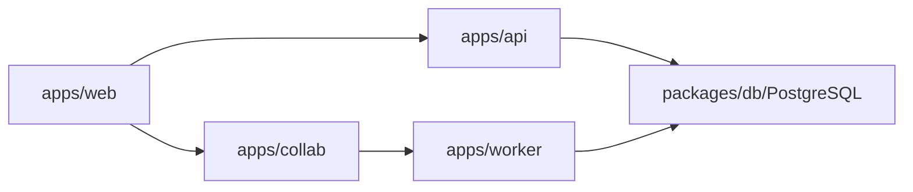

# 技术设计: 开发体系初始化

## 技术方案

### 核心技术

- Bun workspaces catalog
- Turborepo
- React 19 + Vite 8
- Plate 53 + shadcn/ui + Tailwind v4
- Hono
- Hocuspocus/Yjs
- PostgreSQL + Drizzle ORM
- TanStack Query/Router/Table/Form
- Zustand
- Mastra + AI SDK

### 实现要点

- 根 `package.json` 管理 workspace 和依赖 catalog。
- 共享 TS config 放在 `packages/typescript-config`。
- 跨端 schema 放在 `packages/contracts`。
- 数据 schema 放在 `packages/db`。
- UI token 和组件放在 `packages/ui`。
- 业务 app 只保留框架入口和 health/占位逻辑。

## 架构设计

## 架构决策 ADR

### ADR-001: 四应用拆分

**上下文:** 背景文档明确建议 web、api、collab、worker 拆分，避免业务 API 和协作服务混在一起。
**决策:** 使用 `apps/web`、`apps/api`、`apps/collab`、`apps/worker`。
**理由:** 边界清晰，便于私有化部署、扩缩容、权限隔离和后续 AI workflow。
**替代方案:** 单体 Hono 同时承载 API 和 WebSocket → 拒绝原因: 协作链路和业务链路生命周期不同。
**影响:** 初期目录更多，但长期可维护性更好。

### ADR-002: PostgreSQL 优先

**上下文:** 项目需要文档、搜索、时间线、审计和 AI 上下文，MVP 不宜过早引入 Elasticsearch。
**决策:** PostgreSQL 作为主数据和搜索起点，后续按需引入 pg_trgm、FTS、pgvector。
**理由:** 私有化交付简单，事务和审计一致性好。
**替代方案:** Elasticsearch/OpenSearch 起步 → 拒绝原因: 部署和运维成本高。
**影响:** 初期搜索能力有限，后续可演进。

### ADR-003: Notion 风格 shadcn UI

**上下文:** 用户明确要求 UI 组件使用 shadcn，色彩风格参考 Notion。
**决策:** `packages/ui` 使用 shadcn 组件形态和 Notion 风格中性色 token。
**理由:** 组件可控，适合工作台型产品，便于后续 AI 按规范生成 UI。
**替代方案:** 引入重型组件库 → 拒绝原因: 视觉与交互定制成本高。
**影响:** 需要自行维护组件覆盖面。

## API设计

### GET /health

- **请求:** 无。
- **响应:** `{ ok: true, service: "api", version: "0.1.0" }`

## 数据模型

数据模型见 `packages/db/src/schema.ts` 和 `helloagents/wiki/data.md`。

## 安全与性能

- **安全:** 环境变量由 schema 校验；真实密钥不提交；AI tool 后续必须走权限和审计。
- **性能:** Collab 只触发索引任务，不在输入链路重计算；搜索和 AI 派生数据由 worker 异步处理。

## 测试与部署

- **测试:** `bun install`、`bun run typecheck`、`bun run lint:docs`。
- **部署:** 当前阶段只验证本地开发框架；后续补 Docker/Helm/Sealos 部署规范。
