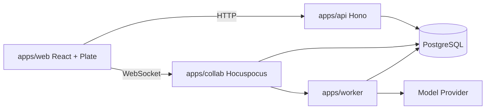
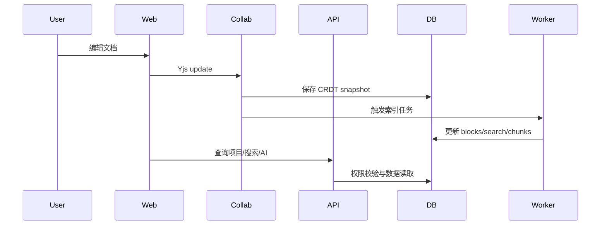

# 架构设计

## 总体架构

## 技术栈

- **前端:** React 19、Vite 8、Plate 53、Tailwind v4、shadcn/ui、TanStack、Zustand。
- **后端:** Hono、Zod、OpenAPIHono。
- **协作:** Hocuspocus、Yjs。
- **数据:** PostgreSQL、Drizzle ORM。
- **后台任务:** Bun、Mastra、Vercel AI SDK。
- **工程化:** Bun workspaces catalog、Turborepo、TypeScript strict。

## 核心流程

## 重大架构决策

| adr_id | title | date | status | affected_modules | details |
|--------|-------|------|--------|------------------|---------|
| ADR-001 | 四应用拆分 | 2026-06-26 | ✅已采纳 | web,api,collab,worker | [how](../history/2026-06/202606261041_framework/how.md#adr-001-四应用拆分) |
| ADR-002 | PostgreSQL 优先 | 2026-06-26 | ✅已采纳 | db,api,worker,collab | [how](../history/2026-06/202606261041_framework/how.md#adr-002-postgresql-优先) |
| ADR-003 | Notion 风格 shadcn UI | 2026-06-26 | ✅已采纳 | web,ui | [how](../history/2026-06/202606261041_framework/how.md#adr-003-notion-风格-shadcn-ui) |
| ADR-004 | Hocuspocus 4 使用 Node 运行时 | 2026-06-26 | ✅已采纳 | collab | [how](../history/2026-06/202606261101_dev_startup_fix/how.md#adr-004-hocuspocus-4-使用-node-运行时) |
| ADR-005 | 开发阶段使用 Drizzle push | 2026-06-26 | ✅已采纳 | db | [how](../history/2026-06/202606261112_ui_db_dev_experience/how.md#adr-005-开发阶段使用-drizzle-push) |
| ADR-006 | Notion 风格图标和块级布局 | 2026-06-26 | ✅已采纳 | web,ui | [how](../history/2026-06/202606261112_ui_db_dev_experience/how.md#adr-006-notion-风格图标和块级布局) |
